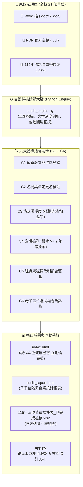
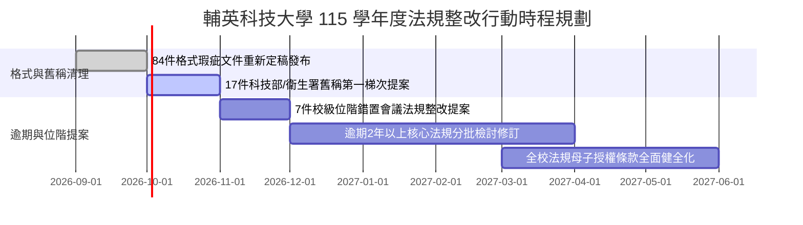

# 🏛️ 輔英科技大學 全校各單位法規檢核與管理系統 (115學年度)

> **一口氣看懂（ELI5）**：  
> 就像學校每年幫每位同學做「健康檢查」一樣，本專案是全校法規的**「自動化法規體檢中心」**！  
> 它把全校 21 個單位、361 部法規檔案全部掃描一遍，幫每一條法規量體溫、照 X 光，抓出「有沒有格式發炎（紅藍字/底線）」、「是不是太久沒修過期生病了（超過 2 年）」、「條文裡是不是還叫著舊部會名稱（如科技部、衛生署）」，最後整理成超漂亮的儀表板與提案處方籤，讓各處室能在 115 學年度行政會議快速提案修訂！

---

## 🧭 視覺化流程圖 (System Architecture)



---

## 🎯 六大檢核指標判定邏輯 (C1 ~ C6)

為避免「問題回答（Yes/No）」與「品質健康（合格/瑕疵）」產生誤解，請參考下表判讀標準：

| 指標代碼 | 檢核項目名稱 | 題目設問邏輯 | 判定符號 | 處置行動方針 |
| :---: | :--- | :--- | :---: | :--- |
| **C1** | **最新版本與位階** | 是否已更新為現行最新版本且登錄位階？ | 🟢 **V = 合格最新**<br>🔴 X = 版本未符 | 登錄至《法規位階關係檔》，追蹤官網最新文檔 |
| **C2** | **法規名稱正確性** | 名稱是否符合「規程/辦法/要點」等法定類型？ | 🟢 **V = 合格正確**<br>🔴 X = 名稱瑕疵 | 補齊更名歷程（如包含「`(原：舊法規名稱)`」） |
| **C3** | **格式完整潔淨度** | 是否純淨無底線、刪除線、紅藍字或修訂標籤？ | 🟢 **V = 格式乾淨**<br>🔴 **X = 格式瑕疵** | **不需開會！** 承辦人自行清除底線與字色後重新上傳 |
| **C4** | **逾期更新提案** | 是否超過 2 年未更新（最後修訂 $\le 112$ 年）？ | 🟡 **V = 逾期需提案**<br>⚪ X = 時效正常 | **需提案！** 列入標註檔，排入 115 學年度行政會議審議 |
| **C5** | **組織規程修訂提案** | 條文是否殘留過時組織舊稱（如科技部、衛生署）？ | 🔴 **V = 含舊稱需提案**<br>⚪ X = 稱謂正常 | **優先提案！** 列入 115-1 行政會議第一梯次優先修訂 |
| **C6** | **母子法位階合規** | 第一條授權母法與核定層級（校務/行政/處務）是否相符？ | 🟢 **V = 位階相符**<br>🟣 **X = 位階待整改** | 釐清上位母法依據，修正提案通過會議位階 |

> 💡 **小秘訣**：
> * **C1、C2、C3** 是「健康體檢題」：`V` 代表健康合格，`X` 代表有瑕疵。
> * **C4、C5** 是「動作提案題」：`V` 代表需要提案整改修法，`X` 代表目前正常不需動作。

---

## 📈 全校法規體檢總體數據 (KPI Summary)

* **受檢法規總數**：**361 案**（涵蓋全校 21 個處室、教學與行政單位）
* **格式完全合規 (C3=V)**：**277 案** (76.7%)
* **格式存在瑕疵 (C3=X)**：**84 案** (23.3%) ⚠️ 須清理修訂符號
* **逾 2 年未更新 (C4=V)**：**207 案** (57.3%) ⚠️ 建議於 115 學年度提案
* **含過時機關舊稱 (C5=V)**：**17 案** (4.7%) 🚨 須於 115-1 優先提案更正
* **母子位階待整改 (C6=X)**：**235 案** (65.1%) ⚠️ 須於第一條補齊上位母法授權

---

## 📁 專案檔案結構導覽

```text
REGULATION-FUYIN-CHECK/
├── index.html                           # 🌟 全校法規管理系統互動儀表板 (雙擊即可在瀏覽器開啟)
├── audit_report.html                    # 📑 法規位階診斷與整改行動統計大屏
├── 115年法規清單檢核表_已完成檢核.xlsx      # 📊 包含 C1~C5 檢核成果的官方 Excel 總表
├── audit_engine.py                      # 🧠 核心檢核引擎 (自動解析 Word/PDF 文本與法規格式)
├── app.py                               # 🚀 Flask 輕量後端伺服器 (支援在線修訂、資料庫連動)
├── build_index_html.py                  # 🛠️ 資料編譯腳本 (將最新 JSON 數據內嵌至 HTML)
├── build_audit_report_html.py           # 🛠️ 報表編譯腳本 (生成獨立靜態統計報告)
├── audit_results.json                   # 💾 361 筆法規完整結構化檢核成果資料庫
├── full_audit_data.json                 # 💾 完整位階拓撲與分析數據
├── 法規位階關係檔.md                     # 📖 全校法規位階關係、授權架構與整改行動建議書
├── 法規檢核條件欄位說明.md               # 📖 C1~C5 官方設問與判定標準詳細解說文件
├── 法規檢核結果總表.md                   # 📖 21 單位橫向比對與各項 KPI 統計總表
├── 法規格式檢核報告.md                   # 📖 84 筆格式瑕疵文檔詳細問題清單 (底線/紅字/標籤)
├── 法規逾期未更新標註檔.md               # 📖 207 筆逾期未修法規列管清單與建議處置
├── templates/                           # 🎨 Flask 模板目錄 (含 index.html 母版)
└── 輔英科大各單位法規彙整/                 # 📚 全校原始法規文本庫 (366 份 PDF/DOCX 檔案)
```

---

## 🚀 快速開始使用指南

### 方式 A：免伺服器，直接在瀏覽器雙擊開啟（最快推薦 🌟）
直接以 Chrome、Edge 等瀏覽器開啟專案根目錄下的：
* **[index.html](file:///D:/GeminiProject/REGULATION-FUYIN-CHECK/index.html)**：即可立即使用完整互動式清冊，支援即時關鍵字搜尋、單位篩選、KPI 卡片篩選與位階關係檢視。
* **[audit_report.html](file:///D:/GeminiProject/REGULATION-FUYIN-CHECK/audit_report.html)**：檢視高階主管決策大屏、母子位階圖表與 115 學年度整改建議。

### 方式 B：啟動 Web 管理後端（支援線上編修存檔）
若需要線上修改檢核標籤並即時寫回 Excel 與 JSON 資料庫：
```bash
# 1. 安裝必要 Python 依賴套件
pip install flask openpyxl python-docx PyMuPDF

# 2. 啟動本機伺服器
python app.py

# 3. 瀏覽器開啟 http://localhost:5000 即可進行在線編修與下載更新後的 Excel
```

### 方式 C：重新執行全自動法規檢核批次作業
當有更新法規檔案至 `輔英科大各單位法規彙整/` 時：
```bash
# 重新執行全校法規文本掃描檢核
python audit_engine.py

# 重新編譯內嵌數據至 HTML 前端
python build_index_html.py
python build_audit_report_html.py
```

---

## 🗓️ 115 學年度整改時程建議



---
*維護單位：輔英科技大學 全校法規檢核專案組*  
*系統版本：v2.0 (115學年度修訂版)*
