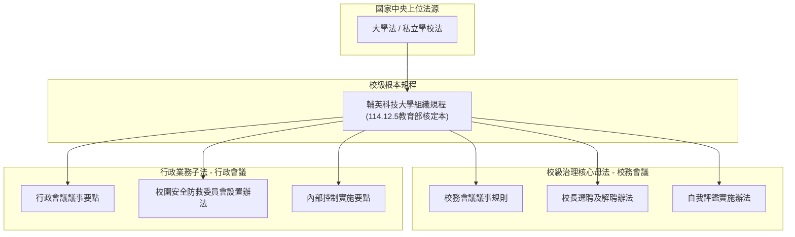
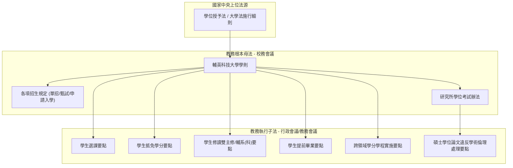
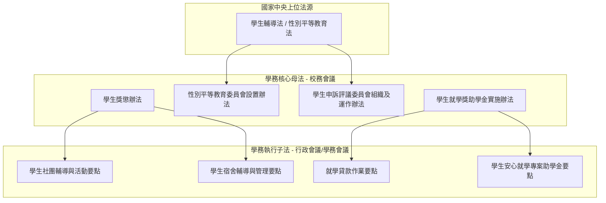
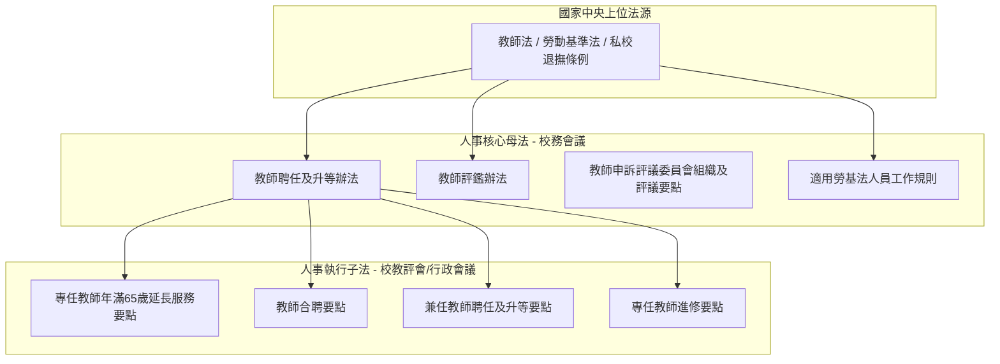
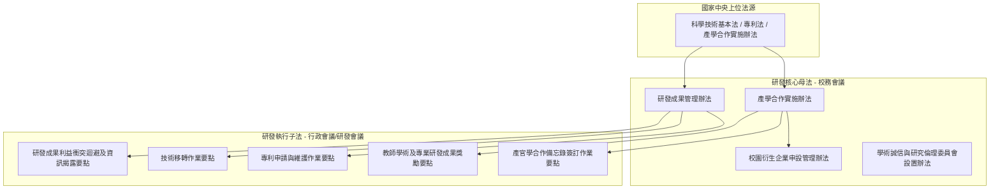
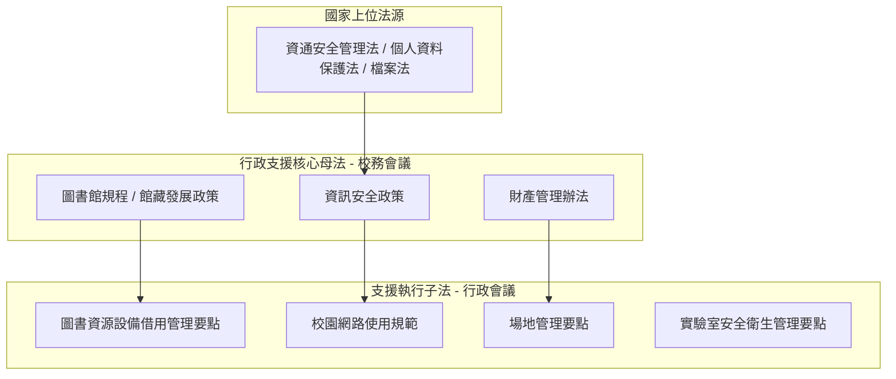

# 輔英科技大學法規位階關係檔

> **檢核依據**：《法規檢核五個條件_更新.docx》第一項條件：「檢測各法規之間是否有母法與子法的位階關係, 建立位階關係檔。」  
> **受檢對象**：輔英科技大學全校 21 個單位、全體 361 筆法規文檔  
> **基準日期**：民國 115 年 9 月

---

## 一、全校法規位階體系總綱

依據我國大學自治憲法法理、《中央法規標準法》及《輔英科技大學組織規程》，本校規章體系依法律位階與審議會議層級，嚴格分為五個授權位階：

| 位階層級 | 規章類型 | 審議／核定會議層級 | 法律效力與規範特徵 | 全校代表性規章 |
| :--- | :--- | :--- | :--- | :--- |
| **第一位階 (上位法源)** | 中央法律／部會法規 | 立法院通過、總統公布／教育部、國科會發布 | 全校法規訂定之最高法源，牴觸者無效 | 《大學法》、《私立學校法》、《學位授予法》、《教師法》、《專利法》 |
| **第二位階 (根本規程)** | 組織規程 | **校務會議**通過、教育部核定 | 本校立校根本大法，設立各行政與學術單位之法源 | 《輔英科技大學組織規程》 |
| **第三位階 (校級核心母法)** | **辦法 (Regulation)**／**學則** | **校務會議**審議通過、校長公布發布 | 涉及師生重大權益、全校性體系及各委員會設置母法 | 《學則》、《產學合作實施辦法》、《教師聘任及升等辦法》、《學生獎懲辦法》 |
| **第四位階 (業務執行子法)** | **要點 (Directions)**／**準則** | **行政會議**／**校教評會**審議通過 | 依據母法或組織規程授權訂定之具體作業要件與審查基準 | 《專利申請要點》、《教師合聘要點》、《兼職回饋金要點》、《場地管理要點》 |
| **第五位階 (作業規範)** | **實施細則／規約／須知** | **處務會議**／**中心會議**／**館務會議**通過 | 執行技術細節、設備借用規則、內部管理標準表單 | 《培育室使用管理要點》、《圖書館閱覽服務要點》、《實驗室安全規則》 |

---

## 二、全校六大核心領域拓撲架構圖 (Mermaid 架構圖)

為釐清全校跨單位法規之母子衍生關聯，以下繪製六大核心行政與教學領域之法規位階拓撲結構：

### 2.1 學校治理與組織根本規程體系

### 2.2 教務教學與學則體系

### 2.3 學生事務與校園生活權益體系

### 2.4 人事師資、聘任與升等體系

### 2.5 研發成果、產學合作與智財管理體系

### 2.6 圖書資訊、總務資產與行政支援體系

---

## 三、全校法規位階與母法參照全清冊 (全校 361 筆)

下表彙整全校 21 個單位全數 361 筆受檢法規之位階層級、核定會議、第一位階上位法源與校內母法依據：

| 序號 | 業管單位 | 法規名稱 | 位階層級 | 審議／核定會議 | 母法依據／上位法源 | 第一條授權／訂定意旨摘要 |
| :---: | :--- | :--- | :--- | :--- | :--- | :--- |
| 001 | 董事會 | **輔英科技大學校長選聘及解聘辦法** | 校級核心母法 (Level 3: 校務會議) | 校務會議 | 大學法、私立學校法 | 本辦法依據大學法第九條、私立學校法第三十二條及第四十一條暨本校 組織規程第十四條等相關規定訂定之。... |
| 002 | 教務處 | **輔英科技大學教務會議設置要點** | 業務執行子法 (Level 4: 行政會議/校教評會) | 行政會議 | 大學法 | 輔英科技大學(以下簡稱本校)依據大學法及本校組織規程，特訂定「輔英科技大學教務會 議設置要點」(以下簡稱本要點)。... |
| 003 | 教務處 | **輔英科技大學教育目標與基本能力制定作業要點(原：輔英科技大學教育目標、基本素養與核心能力制定作業要點)** | 業務執行子法 (Level 4: 行政會議/校教評會) | 行政會議 | 依組織規程/校務行政需要 | ... |
| 004 | 教務處 | **輔英科技大學學生學籍規則** | 校級核心母法 (Level 3: 校務會議) | 校務會議 | 大學法、學位授予法 | 輔英科技大學(以下簡稱本校)為處理學生學籍相關事宜，依據大學法、大學法 施行細則、學位授予法及相關教育法規，特訂定「輔英科技大學學生學籍規則... |
| 005 | 教務處 | **輔英科技大學附設專科部學生學籍規則** | 校級核心母法 (Level 3: 校務會議) | 校務會議 | 學位授予法 | 輔英科技大學(以下簡稱本校)為處理附設專科部（以下簡稱專科部）學生學籍 相關事宜，特依據學位授予法、專科學校法、專科學校法施行細則及相關法 ... |
| 006 | 教務處 | **輔英科技大學學生註冊要點** | 業務執行子法 (Level 4: 行政會議/校教評會) | 行政會議 | 依組織規程/校務行政需要 | 輔英科技大學(以下簡稱本校)為使學生註冊作業有所依循，依據本校「學生學籍規則」 ，特訂定「輔英科技大學學生註冊要點」(以下簡稱本要點)。... |
| 007 | 教務處 | **輔英科技大學學生修讀輔系(科)要點** | 業務執行子法 (Level 4: 行政會議/校教評會) | 行政會議 | 大學法 | 依大學法、本校學生學籍規則及附設專科部學生學籍規則之相關規定，訂定本要點。... |
| 008 | 教務處 | **輔英科技大學學生轉系(所、科)要點(原：輔英科技大學學生轉系要點)** | 業務執行子法 (Level 4: 行政會議/校教評會) | 行政會議 | 大學法 | 本校為辦理學生轉系(所、科)事宜，依據大學法、本校學生學籍規則及本校附設專科部 學生學籍規則，特訂定「輔英科技大學學生轉系(所、科)要點」，... |
| 009 | 教務處 | **輔英科技大學學生學業成績預警實施要點** | 業務執行子法 (Level 4: 行政會議/校教評會) | 行政會議 | 依組織規程/校務行政需要 | 為加強學生學期中對學習狀況之了解及提供教師輔導之依據，特訂定本要點。... |
| 010 | 教務處 | **輔英科技大學學生抵免學分要點** | 業務執行子法 (Level 4: 行政會議/校教評會) | 行政會議 | 依組織規程/校務行政需要 | 輔英科技大學(以下簡稱本校)為提供學生適性發展的學習生涯及充分發揮教學資源的效 益，特訂定「輔英科技大學學生抵免學分要點」(以下簡稱本要點)... |
| 011 | 教務處 | **輔英科技大學辦理延聘論文指導教授要點** | 業務執行子法 (Level 4: 行政會議/校教評會) | 行政會議 | 依組織規程/校務行政需要 | 輔英科技大學(以下簡稱本校)為各系（所）辦理延聘研究生論文指導教授有所依循，特 訂定「輔英科技大學辦理延聘論文指導教授要點」(以下簡稱本要點... |
| 012 | 教務處 | **輔英科技大學雙主修要點** | 業務執行子法 (Level 4: 行政會議/校教評會) | 行政會議 | 大學法、學位授予法 | 本要點依大學法、大學法施行細則、學位授予法、本校學生學籍規則及附設專科部學生 學籍規則相關規定訂定之。... |
| 013 | 教務處 | **輔英科技大學研究生助學金實施要點** | 業務執行子法 (Level 4: 行政會議/校教評會) | 行政會議 | 本校學生就學獎助學金實施辦法 | 輔英科技大學(以下簡稱本校)依據本校「學生就學獎助學金實施辦法」、「學生兼任助理 學習與勞動權益保障處理要點」及「獎助生施行要點」，特訂定「... |
| 014 | 教務處 | **輔英科技大學與大陸地區及國外大學校院辦理雙聯學制實施要點** | 業務執行子法 (Level 4: 行政會議/校教評會) | 行政會議 | 依組織規程/校務行政需要 | 本校為拓展學生視野，增進國際學術合作，加強各學院系（科）所與大陸地區及國外大 學校院學生之交流學習，特訂定本要點。... |
| 015 | 教務處 | **輔英科技大學學生至大陸地區及出國期間學籍及學業處理要點** | 業務執行子法 (Level 4: 行政會議/校教評會) | 行政會議 | 依組織規程/校務行政需要 | 輔英科技大學(以下簡稱本校)為辦理學生於肄業期間至大陸地區及出國，有關學籍及學 業之處理，特訂定「輔英科技大學學生至大陸地區及出國期間學籍及... |
| 016 | 教務處 | **輔英科技大學書卷獎獎勵要點** | 業務執行子法 (Level 4: 行政會議/校教評會) | 行政會議 | 依組織規程/校務行政需要 | 輔英科技大學(以下簡稱本校)為獎勵學生努力向學，提昇校園讀書風氣，特訂定「輔英科 技大學書卷獎獎勵要點」(以下簡稱本要點)。... |
| 017 | 教務處 | **輔英科技大學課程委員會設置辦法** | 校級核心母法 (Level 3: 校務會議) | 校務會議 | 本校組織規程 | 輔英科技大學（以下簡稱本校）為規劃、研議與審訂本校課程，培育優質人才，達成 教育目標，依本校組織規程第十一條，特訂定「輔英科技大學課程委員會... |
| 018 | 教務處 | **輔英科技大學學生選課要點** | 業務執行子法 (Level 4: 行政會議/校教評會) | 行政會議 | 大學法 | 輔英科技大學(以下簡稱本校)為辦理學生選課相關事宜，依據大學法、專科學校法與本 校學生學籍規則等相關規定，特訂定「輔英科技大學學生選課要點」... |
| 019 | 教務處 | **輔英科技大學開辦暑期課程要點** | 業務執行子法 (Level 4: 行政會議/校教評會) | 行政會議 | 依組織規程/校務行政需要 | 依據本校「學生學籍規則」第十四條規定訂定本要點。... |
| 020 | 教務處 | **輔英科技大學校際選課要點** | 業務執行子法 (Level 4: 行政會議/校教評會) | 行政會議 | 依組織規程/校務行政需要 | 輔英科技大學(以下簡稱本校)為促進校際合作，便利學生選修他校開設之課程，依本校 學生學籍規則之校際選課相關規定，特訂定「輔英科技大學校際選課... |
| 021 | 教務處 | **輔英科技大學跨領域學分學程實施與學生修習要點(原：輔英科技大學跨領域學分學程開設暨學生修習要點、學分學程開設暨學生修習要點)** | 業務執行子法 (Level 4: 行政會議/校教評會) | 行政會議 | 依組織規程/校務行政需要 | 輔英科技大學(以下簡稱本校)為提供學生更多的修課彈性與跨領域學習機會，增進其生 涯與職涯發展能力，特訂定「輔英科技大學跨領域學分學程實施與學... |
| 022 | 教務處 | **輔英科技大學研究生碩士學位考試要點** | 業務執行子法 (Level 4: 行政會議/校教評會) | 行政會議 | 大學法、學位授予法 | 本要點依據大學法、大學法施行細則、學位授予法及本校學生學籍規則訂定之。... |
| 023 | 教務處 | **輔英科技大學必修科目免修要點** | 業務執行子法 (Level 4: 行政會議/校教評會) | 行政會議 | 依組織規程/校務行政需要 | 為提昇學習成效，發展適性教學，特訂定本要點。... |
| 024 | 教務處 | **輔英科技大學辦理高級中等學校學生預修大學課程要點** | 業務執行子法 (Level 4: 行政會議/校教評會) | 行政會議 | 依組織規程/校務行政需要 | 輔英科技大學(以下簡稱本校)為強化與技術型高級中等學校、普通型高級中等學校及綜 合型高級中等學校（以下簡稱高級中等學校）合作關係，提供學生預... |
| 025 | 教務處 | **輔英科技大學一般教室冷氣空調管理要點** | 業務執行子法 (Level 4: 行政會議/校教評會) | 行政會議 | 依組織規程/校務行政需要 | 輔英科技大學為有效運用與節省能源，創造師生舒適之學習空間，確保教學品質，特訂 定「輔英科技大學一般教室冷氣空調管理要點」(以下簡稱本要點)。... |
| 026 | 教務處 | **輔英科技大學遠距教學數位學習課程實施要點(原：輔英科技大學遠距教學作業要點)** | 業務執行子法 (Level 4: 行政會議/校教評會) | 行政會議 | 教育部頒布之專科以上學校遠距教學實施辦法 | 輔英科技大學(以下簡稱本校)為提供學生多元學習管道，促進學生數位學習成效及遠距 教學課程品質，特依據教育部頒布之「專科以上學校遠距教學實施辦... |
| 027 | 教務處 | **輔英科技大學學生停課、復（補）課及學習輔導應變措施要點** | 業務執行子法 (Level 4: 行政會議/校教評會) | 行政會議 | 依組織規程/校務行政需要 | 本校為因應非人為不可抗力因素，導致學生學習受到影響，為維護學生學習權益，特訂 定「輔英科技大學學生停課、復（補）課及學習輔導應變措施要點」(... |
| 028 | 教務處 | **輔英科技大學業界專家協同教學實施要點** | 業務執行子法 (Level 4: 行政會議/校教評會) | 行政會議 | 依組織規程/校務行政需要 | 輔英科技大學(以下簡稱本校)為深化技職教育之實務教學，引進業界師資參與教學並豐 富教學內容，培育具有實作能力及就業力之優質專業人才，特訂定「... |
| 029 | 教務處 | **輔英科技大學教學管理實施要點** | 業務執行子法 (Level 4: 行政會議/校教評會) | 行政會議 | 依組織規程/校務行政需要 | 輔英科技大學（以下簡稱本校）為瞭解學生學習狀況與教師教學情形，促進教學正常化， 維護良好校園學習環境，確保教學品質，特訂定「輔英科技大學教學... |
| 030 | 教務處 | **輔英科技大學專任教師授課要點** | 校級核心母法 (Level 3: 校務會議) | 校務會議 | 大學法 | 輔英科技大學(以下簡稱本校)為維護教學品質及妥善運用教學人力，依大學法和大學法 施行細則，特訂定「輔英科技大學專任教師授課要點」(以下簡稱本... |
| 031 | 教務處 | **輔英科技大學全英語授課課程實施要點(原：輔英科技大學英（外）語授課獎勵要點)** | 業務執行子法 (Level 4: 行政會議/校教評會) | 行政會議 | 依組織規程/校務行政需要 | 輔英科技大學(以下簡稱本校)為提升學生英語能力及培養國際化視野，鼓勵教師英語授 課，特訂定「輔英科技大學全英語授課課程實施要點」(以下簡稱本... |
| 032 | 教務處 | **輔英科技大學科目表制定及課程開設要點** | 業務執行子法 (Level 4: 行政會議/校教評會) | 行政會議 | 依組織規程/校務行政需要 | 輔英科技大學(以下簡稱本校)為配合國家技職教育政策，培育符合社會職場需求之專業 人才，特訂定「輔英科技大學科目表制定及課程開設要點」(以下簡... |
| 033 | 教務處 | **輔英科技大學實務專題製作實施要點** | 業務執行子法 (Level 4: 行政會議/校教評會) | 行政會議 | 依組織規程/校務行政需要 | 為增進本校學生實作與實務專題製作之能力，特訂定實務專題製作實施要點(以下簡稱本 要點）。... |
| 034 | 教務處 | **輔英科技大學教師課程點名作業要點(原：輔英科技大學學生上課點名實施要點)** | 業務執行子法 (Level 4: 行政會議/校教評會) | 行政會議 | 依組織規程/校務行政需要 | 輔英科技大學(以下簡稱本校)為提升教學品質與建立學生良好學習風氣，特訂定「輔英科 技大學教師課程點名作業要點」(以下簡稱本要點)。。... |
| 035 | 教務處 | **輔英科技大學考試規則** | 業務執行子法 (Level 4: 行政會議) | 行政會議 | 依組織規程/校務行政需要 | 為維護考試公平性及培養本校學生優良學習風氣，特訂定本考試規則。... |
| 036 | 教務處 | **輔英科技大學課程審查作業要點** | 業務執行子法 (Level 4: 行政會議/校教評會) | 行政會議 | 依組織規程/校務行政需要 | 輔英科技大學(以下簡稱本校)為提升本校課程規劃品質，強化各開課單位課程結構與課程 計畫，增進學生基本素養與專業核心能力，特訂定「輔英科技大學... |
| 037 | 教務處 | **輔英科技大學維護突遭重大災害學生學習權益處理原則** | 業務執行子法 (Level 4: 行政會議/校教評會) | 行政會議 | 依組織規程/校務行政需要 | 為維護突遭重大災害學生學習權益，特依教育部頒佈「專科以上學校維護突遭重 大災害學生學習權益處理原則」，訂定本校維護突遭重大災害學生學習權益處... |
| 038 | 教務處 | **輔英科技大學遠距教學推動委員會設置要點** | 業務執行子法 (Level 4: 行政會議/校教評會) | 行政會議 | 依組織規程/校務行政需要 | 輔英科技大學（以下簡稱本校）為推動遠距教學，鼓勵教師開設遠距課程以提供學生多元 化學習方式，並促進遠距教學品質及學習成效，特設置「輔英科技大... |
| 039 | 教務處 | **輔英科技大學教師調、補、代課要點** | 校級核心母法 (Level 3: 校務會議) | 校務會議 | 依組織規程/校務行政需要 | 為保障修課學生權益並兼顧教師請假之需要，特依據本校「專任教師聘任待遇服務規則」、 「教職員工請假、休假辦法」、「兼任教師聘任待遇服務規則」與... |
| 040 | 教務處 | **輔英科技大學專任教師基本授課學時數不足處理辦法** | 校級核心母法 (Level 3: 校務會議) | 校務會議 | 依組織規程/校務行政需要 | 本校為使專任教師基本授課學時數不足(以下簡稱授課鐘點不足)之處理有所依循，特 訂定輔英科技大學「專任教師基本授課學時數不足處理辦法」(以下簡... |
| 041 | 教務處 | **輔英科技大學碩士學位論文違反學術倫理案件處理要點** | 業務執行子法 (Level 4: 行政會議/校教評會) | 行政會議 | 學位授予法 | 輔英科技大學(以下簡稱本校)為確立碩士學位論文涉 嫌違反學術倫理案件之公正客觀處 案件之公正客觀處 理 程序，特依據學位授予法，訂定 程序，... |
| 042 | 教務處 | **輔英科技大學自主學習課程實施要點** | 業務執行子法 (Level 4: 行政會議/校教評會) | 行政會議 | 依組織規程/校務行政需要 | 輔英科技大學(以下簡稱本校)為促進學生自主學習能力，提供學生彈性多元及跨領域學習 機會，特訂定「輔英科技大學自主學習課程實施要點」(以下簡稱... |
| 043 | 教務處 | **輔英科技大學研究生學位論文指導費及相關費用支給要點** | 業務執行子法 (Level 4: 行政會議/校教評會) | 行政會議 | 依組織規程/校務行政需要 | 輔英科技大學（以下簡稱本校）為使本校研究生學位論文指導費、論文計畫審查費暨學 文計畫審查費暨學 位考試委員口試費及交通費發放有所依據，特訂定... |
| 044 | 教務處 | **輔英科技大學學位授予實施要點** | 業務執行子法 (Level 4: 行政會議/校教評會) | 行政會議 | 大學法、學位授予法 | 輔英科技大學(以下簡稱本校)依據大學法、學位授予法及各類學位名稱訂定程序授予要 件及代替碩士博士論文認定準則，特訂定「輔英科技大學學位授予實... |
| 045 | 教務處 | **輔英科技大學研究生學位論文品保檢核機制要點** | 業務執行子法 (Level 4: 行政會議/校教評會) | 行政會議 | 學位授予法 | 輔英科技大學(以下簡稱本校)為確保研究生學位論文之品質，建立學位論文品保檢核機 制，依據教育部109 年8 月19 日臺教高通字第10901... |
| 046 | 教務處 | **輔英科技大學運動傑出學生彈性修讀課程要點** | 業務執行子法 (Level 4: 行政會議/校教評會) | 行政會議 | 本校學則 | 輔英科技大學（以下簡稱本校）為培育國際競賽頂尖人才，使其兼顧學業、訓練與比賽， 並落實本校教育功能與提升運動競技水準，依據本校學則第十六條之... |
| 047 | 教務處 | **輔英科技大學教學空間管理與借用要點** | 業務執行子法 (Level 4: 行政會議/校教評會) | 行政會議 | 依組織規程/校務行政需要 | 輔英科技大學(以下簡稱本校)為充份運用及有效管理教學空間，達到教學資源永續利用 之目的，特訂定「輔英科技大學教學空間管理與借用要點」(以下簡... |
| 048 | 教務處 | **輔英科技大學跨領域共授課程實施要點** | 業務執行子法 (Level 4: 行政會議/校教評會) | 行政會議 | 依組織規程/校務行政需要 | 輔英科技大學(以下簡稱本校)為推動跨領域教學創新，培養學生跨領域競爭力，鼓勵教 師共同開授跨領域教學創新性課程，特訂定「輔英科技大學跨領域共... |
| 049 | 教務處 | **輔英科技大學學士班學生就學期間服役彈性修業實施要點** | 業務執行子法 (Level 4: 行政會議/校教評會) | 行政會議 | 本校學則 | 輔英科技大學（以下簡稱本校）為因應學士班學生就學期間服役（以下簡稱就學役男） 職涯發展需求，並配合國家兵役政策推動，提供就學役男相關彈性修業... |
| 050 | 教務處 | **輔英科技大學學生跨領域學習獎勵要點** | 業務執行子法 (Level 4: 行政會議/校教評會) | 行政會議 | 依組織規程/校務行政需要 | 輔英科技大學(以下簡稱本校)為獎勵學生跨領域多元學習，增進其生涯與職涯發展能力， 特訂定「輔英科技大學學生跨領域學習獎勵要點」(以下簡稱本要... |
| 051 | 教務處 | **輔英科技大學招生委員會設置辦法** | 校級核心母法 (Level 3: 校務會議) | 校務會議 | 大學法、輔英科技大學組織規程 | 輔英科技大學為辦理招生工作，特依據大學法及輔英科技大學組織規程設置輔英科 技大學招生委員會（以下簡稱本委員會）。... |
| 052 | 教務處 | **輔英科技大學碩士班招生規定(原：碩士班招生辦法)** | 校級核心母法 (Level 3: 校務會議) | 校務會議 | 大學法 | 本校為辦理碩士班招生依據大學法第二十四條、大學法施行細則第十九條、大學 辦理招生規定審核作業要點及入學大學同等學力認定標準訂定。... |
| 053 | 教務處 | **輔英科技大學二年制學士班申請入學招生規定(原：二技申請入學招生規定)** | 業務執行子法 (Level 4: 行政會議) | 行政會議 | 大學法 | 本校為辦理二年制學士班申請入學招生，依「大學法」第二十四條暨第二十五條、 「大學法施行細則」第十九條、「技專校院單獨招生處理原則」及「入學大... |
| 054 | 教務處 | **輔英科技大學招生宣傳活動經費補助注意事項(原：輔英科技大學104學年度招生宣傳活動經費補助注意事項)** | 業務執行子法 (Level 4: 行政會議/校教評會) | 行政會議 | 依組織規程/校務行政需要 | 輔英科技大學（以下簡稱本校）為鼓勵各學系、學院或其他被賦予招生任務之單位辦理 各種招生宣傳與相關之交流活動，特訂定「輔英科技大學招生宣傳活動... |
| 055 | 教務處 | **輔英科技大學優秀新生獎獎勵要點(112學年度)、輔英科技大學優秀新生獎獎勵要點(113學年度)、輔英科技大學優秀新生獎獎勵要點(114學年度)、輔英科技大學優秀新生獎獎勵要點(115學年度)** | 業務執行子法 (Level 4: 行政會議/校教評會) | 行政會議 | 依組織規程/校務行政需要 | 輔英科技大學（以下簡稱本校）為鼓勵國中、高中(職)及大專校院成績優秀之畢業學生來 校就讀，特訂定「輔英科技大學優秀新生獎獎勵要點」（以下簡稱... |
| 056 | 教務處 | **輔英科技大學四技日間部單獨招生規定** | 業務執行子法 (Level 4: 行政會議) | 行政會議 | 大學法 | 本校為辦理四技日間部單獨招生，依據「大學法」第二十四條、「大學法施行細則」 第十九條、「大學辦理招生規定審核作業要點」、「技專校院單獨招生處... |
| 057 | 教務處 | **輔英科技大學四技進修部單獨招生規定** | 業務執行子法 (Level 4: 行政會議) | 行政會議 | 大學法 | 本校為辦理四技進修部單獨招生，依據「大學法」第二十四條、「大學法施行細則」 第十九條、「大學辦理招生規定審核作業要點」、「技專校院單獨招生處... |
| 058 | 教務處 | **輔英科技大學離島地區國中應屆畢業生升學五專保送甄選招生規定** | 業務執行子法 (Level 4: 行政會議) | 行政會議 | 大學法 | 本規定依大學法第廿四條、專科學校法第三十一條、離島地區學生保送高級中等以 上學校辦法及教育部相關規定訂定之。... |
| 059 | 教務處 | **輔英科技大學五專免試續招入學招生規定** | 業務執行子法 (Level 4: 行政會議) | 行政會議 | 專科學校法 | 本校為辦理五專免試續招入學招生，依據專科學校法第三十一條、五專多元入學方 案及技專校院單獨招生處理原則等相關規定訂定之。... |
| 060 | 教務處 | **輔英科技大學大學部暨附設專科部轉學招生規定** | 業務執行子法 (Level 4: 行政會議) | 行政會議 | 大學法 | 本校為辦理大學部暨附設專科部轉學招生，依據「大學法」、「大學法施行細則」、「大 學辦理招生規定審核作業要點」、「專科學校法」、「專科學校法施... |
| 061 | 教務處 | **輔英科技大學重點運動項目績優學生單獨招生規定** | 業務執行子法 (Level 4: 行政會議) | 行政會議 | 依組織規程/校務行政需要 | 本校為培育優秀體育運動人才，辦理運動績優學生單獨招生事宜，特依據「大學 法第24 條暨其施行細則第19 條」規定、「大學辦理招生規定審核作業... |
| 062 | 教務處 | **輔英科技大學教學品質保證實施辦法(原：教學品質保證委員會設置辦法)** | 校級核心母法 (Level 3: 校務會議) | 校務會議 | 依組織規程/校務行政需要 | 輔英科技大學（以下簡稱本校）為確保教學品質，提昇學生學習成效，特訂定「輔英 科技大學教學品質保證實施辦法」(以下簡稱本辦法)。... |
| 063 | 教務處 | **輔英科技大學教學品質保證實施要點** | 業務執行子法 (Level 4: 行政會議/校教評會) | 行政會議 | 依組織規程/校務行政需要 | 本校為確保教學品質，提昇學生學習成效，特依據「輔英科技大學教學品質保證委員會 設置辦法」... |
| 064 | 教務處 | **輔英科技大學教學評量實施要點** | 業務執行子法 (Level 4: 行政會議/校教評會) | 校教評會 | 依組織規程/校務行政需要 | 輔英科技大學(以下簡稱本校)為提昇教學品質，需評估教學成效、反映學生學習狀況，以作為 教師改進教學之重要參考，並建立師生良好互動關係，特訂定... |
| 065 | 教務處 | **輔英科技大學教師研習經費補助要點** | 業務執行子法 (Level 4: 行政會議/校教評會) | 校教評會 | 依組織規程/校務行政需要 | 輔英科技大學（以下簡稱本校）為鼓勵本校教師參加專業領域相關之研習，以加強教師 之專業知識並提升教學研究之水準，特訂定「輔英科技大學教師研習經... |
| 066 | 教務處 | **輔英科技大學學術活動經費補助要點** | 業務執行子法 (Level 4: 行政會議/校教評會) | 校教評會 | 依組織規程/校務行政需要 | 輔英科技大學(以下簡稱本校)為提昇專業品質及促進學術交流，特訂定「輔英科技大學 學術活動經費補助要點」(以下簡稱本要點)。... |
| 067 | 教務處 | **輔英科技大學獎勵教師取得專業證照要點** | 業務執行子法 (Level 4: 行政會議/校教評會) | 校教評會 | 依組織規程/校務行政需要 | 輔英科技大學（以下簡稱本校）為積極鼓勵專任教師參加專業證照檢定考試，以提升師資 專業實務能力，獎勵教師取得專業證照，特訂定「輔英科技大學獎勵... |
| 068 | 教務處 | **輔英科技大學教師創新教學研究計畫補助要點(原：輔英科技大學改進教學專題研究計畫補助要點)** | 業務執行子法 (Level 4: 行政會議/校教評會) | 校教評會 | 依組織規程/校務行政需要 | 輔英科技大學(以下簡稱本校)為推動本校教師從事創新教學之研究，增進教學成效，提昇教學品 質，特訂定「輔英科技大學教師創新教學研究計畫補助要點... |
| 069 | 教務處 | **輔英科技大學教學評量管理委員會設置要點** | 業務執行子法 (Level 4: 行政會議/校教評會) | 行政會議 | 依組織規程/校務行政需要 | 為提升本校教學品質，改善教學成效，並協助教師教學專業知能之發展，設置教學評量管理委員 會(以下簡稱本會)。... |
| 070 | 教務處 | **輔英科技大學提升教師教學績效輔導要點** | 業務執行子法 (Level 4: 行政會議/校教評會) | 校教評會 | 依組織規程/校務行政需要 | 輔英科技大學（以下簡稱本校）為提升教師教學績效，精進教學品質，以促進學生學習 成效，特訂定「輔英科技大學提升教師教學績效輔導要點」(以下簡稱... |
| 071 | 教務處 | **輔英科技大學教學諮詢小組設置要點** | 業務執行子法 (Level 4: 行政會議/校教評會) | 行政會議 | 依組織規程/校務行政需要 | 為精進教師教學品質，提升教學成效，協助教師教學專業知能之發展與提供教師教學支持 系統，設置教學諮詢小組（以下簡稱本小組）。... |
| 072 | 教務處 | **輔英科技大學教師專業成長社群實施要點** | 業務執行子法 (Level 4: 行政會議/校教評會) | 校教評會 | 依組織規程/校務行政需要 | 輔英科技大學(以下簡稱本校)為促進教師教學成效並推動彼此間經驗交流，鼓勵教師組成教師專 業成長社群，藉由多元主題的討論與分享，提昇教師專業教... |
| 073 | 教務處 | **輔英科技大學數位學習教材獎助要點(原：輔輔英科技大學數位學習教材獎勵要點)** | 業務執行子法 (Level 4: 行政會議/校教評會) | 校教評會 | 依組織規程/校務行政需要 | 輔英科技大學(以下簡稱本校)為鼓勵本校教師投入製作數位學習教材，並確保數位學習 教材品質，特訂定「輔英科技大學數位學習教材獎助要點」(以下簡... |
| 074 | 教務處 | **輔英科技大學磨課師課程實施要點** | 業務執行子法 (Level 4: 行政會議/校教評會) | 行政會議 | 依組織規程/校務行政需要 | 輔英科技大學(以下簡稱本校)為鼓勵本校教師推動新一代數位學習方式，鼓勵教師 創新教學開設磨課師課程(Massive Open Online ... |
| 075 | 教務處 | **輔英科技大學教師教學產出成果競賽獎勵要點** | 業務執行子法 (Level 4: 行政會議/校教評會) | 校教評會 | 依組織規程/校務行政需要 | 輔英科技大學(以下簡稱本校)為鼓勵本校教師以創新教學方式設計課程、充實教學內容 並革新教學方法，提升教學效能，並將自身教學用之教材、教具、媒... |
| 076 | 教務處 | **輔英科技大學教學觀議課實施要點** | 業務執行子法 (Level 4: 行政會議/校教評會) | 校教評會 | 依組織規程/校務行政需要 | 輔英科技大學（以下簡稱本校）為落實教學品保，提升本校教師教學精進與學生學習成效，推動 教師教學觀課，作為教學觀摩與經驗傳承，特訂定「輔英科技... |
| 077 | 教務處 | **輔英科技大學數位學習平台管理要點** | 業務執行子法 (Level 4: 行政會議/校教評會) | 行政會議 | 依組織規程/校務行政需要 | 輔英科技大學（以下簡稱本校）為維護本校數位學習平台（以下簡稱本學習平台）之運作品 質、提升教學成效，並妥善管理系統儲存空間與課程資料保存，特... |
| 078 | 教務處 | **輔英科技大學教師輔導學生學習成效獎勵實施要點** | 業務執行子法 (Level 4: 行政會議/校教評會) | 行政會議 | 依組織規程/校務行政需要 | 輔英科技大學（以下簡稱本校）為鼓勵本校專任教師輔導學生考取證照或參加技能型競賽， 以展現學生學習成效，特訂定「輔英科技大學教師輔導學生學習成... |
| 079 | 教務處 | **輔英科技大學學生校外實習委員會設置辦法** | 校級核心母法 (Level 3: 校務會議) | 校務會議 | 教育部專科以上學校產學合作實施辦法 | 輔英科技大學（以下簡稱本校）為順利推動學生校外實習各項業務，提升實習品質與 績效，茲依據教育部「專科以上學校產學合作實施辦法」第六條規定，特... |
| 080 | 教務處 | **輔英科技大學學生校外實習要點** | 業務執行子法 (Level 4: 行政會議/校教評會) | 行政會議 | 依組織規程/校務行政需要 | 輔英科技大學(以下簡稱本校)為推動學生職場實務訓練，培養學生具務實致用的能力， 以進行學生職場體驗，增加學生於職場適應力與就業競爭力，達到畢... |
| 081 | 教務處 | **輔英科技大學學生海外實務學習要點** | 業務執行子法 (Level 4: 行政會議/校教評會) | 行政會議 | 依組織規程/校務行政需要 | 輔英科技大學(以下簡稱本校)為拓展學生國際視野、培養國際移動力，增進就業競爭 力，依據「輔英科技大學學生校外實習要點」第四點第三款第三目，特... |
| 082 | 教務處 | **輔英科技大學海外實務學習課程補助實施要點** | 業務執行子法 (Level 4: 行政會議/校教評會) | 行政會議 | 依組織規程/校務行政需要 | 輔英科技大學(以下簡稱本校)為鼓勵各系(科)規劃與執行學生海外實務學習課程，拓展國際 實務學習視野，提升未來進入職場競爭力，依據「輔英科技大... |
| 083 | 教務處 | **輔英科技大學學生證照獎勵實施要點** | 業務執行子法 (Level 4: 行政會議/校教評會) | 行政會議 | 依組織規程/校務行政需要 | 輔英科技大學(以下簡稱本校)為鼓勵學生取得專業證照與語言類證照，以提升學生專業實 務能力與就業力，特訂定「輔英科技大學學生證照獎勵實施要點」... |
| 084 | 教務處 | **輔英科技大學激勵學習安心就學作業要點** | 業務執行子法 (Level 4: 行政會議/校教評會) | 行政會議 | 依組織規程/校務行政需要 | 輔英科技大學(以下簡稱本校)依據教育部「高等教育深耕計畫-提升高教公共性：完善就 學協助機制，有效促進社會流動」相關規定，特訂定「輔英科技大... |
| 085 | 教務處 | **輔英科技大學學生共學團體實施要點** | 業務執行子法 (Level 4: 行政會議/校教評會) | 行政會議 | 依組織規程/校務行政需要 | 實施目的  輔英科技大學(以下簡稱本校)為提升學生學習風氣，透過同儕激勵與知識分享，以增進學 習動機與效能，特訂定「輔英科技大學學生共學團體... |
| 086 | 教務處 | **輔英科技大學學習導航老師實施要點** | 業務執行子法 (Level 4: 行政會議/校教評會) | 行政會議 | 依組織規程/校務行政需要 | 目的  輔英科技大學(以下簡稱本校)為提供學生多元的學習指導服務，建立學習導航老師制度，以提升 學生學習成效，特訂定「輔英科技大學學習導航老... |
| 087 | 學務處 | **輔英科技大學學生事務會議設置要點** | 業務執行子法 (Level 4: 行政會議/校教評會) | 行政會議 | 本校組織規程 | 輔英科技大學(以下簡稱本校)依據本校組織規程，特訂定「輔英科技大學學生事務會議設 置要點」(以下簡稱本要點)。... |
| 088 | 學務處 | **輔英科技大學性別平等教育委員會設置辦法** | 校級核心母法 (Level 3: 校務會議) | 校務會議 | 性別平等教育法 | 輔英科技大學(以下簡稱本校)為促進性別地位之實質平等，消除性別歧視，維護人格 尊嚴，厚植並建立性別平等之教育資源與環境，並依據「性別平等教育... |
| 089 | 學務處 | **輔英科技大學性別平等教育實施辦法(原：性別平等教育實施要點)** | 校級核心母法 (Level 3: 校務會議) | 校務會議 | 性別平等教育法 | 輔英科技大學（以下簡稱本校）為落實推動性別平等教育工作，促進性別地位之 實質平等，消除性別歧視，維護人格尊嚴，厚植並建立性別平等之教育資源與... |
| 090 | 學務處 | **輔英科技大學校園性別事件防治辦法** | 校級核心母法 (Level 3: 校務會議) | 校務會議 | 性別平等教育法 | 輔英科技大學(以下簡稱本校)為處理校園性別事件，依性別平等教育法、校園性別事件防 治準則，訂定「輔英科技大學校園性別事件防治辦法」(以下簡稱... |
| 091 | 學務處 | **輔英科技大學學生事務處行政人員職務交接作業要點** | 業務執行子法 (Level 4: 行政會議/校教評會) | 行政會議 | 依組織規程/校務行政需要 | 輔英科技大學(以下簡稱本校)為健全學生事務處(以下簡稱學務處)行政之正常運 作，特訂定「輔英科技大學學生事務處行政人員職務交接作業要點」（以... |
| 092 | 學務處 | **輔英科技大學學生懷孕受教權維護及輔導協助要點** | 業務執行子法 (Level 4: 行政會議/校教評會) | 行政會議 | 性別平等教育法 | 輔英科技大學(以下簡稱本校)為落實性別平等教育法及性別平等教育法施行細則之規定， 並依據教育部「學生懷孕受教權維護及輔導協助要點」，積極維護... |
| 093 | 學務處 | **輔英科技大學學生宿舍收、退費要點** | 業務執行子法 (Level 4: 行政會議/校教評會) | 行政會議 | 依組織規程/校務行政需要 | 依據本校學生申請住宿實際需要，特訂定「輔英科技大學學生宿舍收、退費要點」（以下 簡稱本要點）。... |
| 094 | 學務處 | **輔英科技大學宿舍履約保證金收、退費要點** | 業務執行子法 (Level 4: 行政會議/校教評會) | 行政會議 | 依組織規程/校務行政需要 | 輔英科技大學(以下簡稱本校)為因應本校學制多元化的發展及培養學生守法、守紀與負責任的精 神，特訂定「輔英科技大學宿舍履約保證金收、退費要點」... |
| 095 | 學務處 | **輔英科技大學導師制度實施辦法(原：大學部導師制度實施辦法)** | 校級核心母法 (Level 3: 校務會議) | 校務會議 | 依組織規程/校務行政需要 | 輔英科技大學(以下簡稱本校)為落實本校學生輔導工作之實際需求，特訂輔英科 技大學導師制度實施辦法(以下簡稱本辦法)。... |
| 096 | 學務處 | **輔英科技大學學生獎懲規定** | 校級核心母法 (Level 3: 校務會議) | 校務會議 | 大學法、教育部大學法 | 依據教育部大學法第三十二條規定：『大學為確保學生學習效果，並建立學生行為規  範，應訂定學則及獎懲規定，並報教育部備查』訂定輔英科技大學學生... |
| 097 | 學務處 | **輔英科技大學專科學生獎懲規定** | 校級核心母法 (Level 3: 校務會議) | 校務會議 | 教育部專科學校法 | 依據教育部專科學校法第四十一條規定：『專科學校為確保學生學習效果，並建立學 生行為規範，應訂定學則及獎懲規定，報教育部備查。』訂定輔英科技大... |
| 098 | 學務處 | **輔英科技大學學生操行成績評定要點(原：大學學生操行成績評定要點)** | 業務執行子法 (Level 4: 行政會議/校教評會) | 行政會議 | 依組織規程/校務行政需要 | 本要點為每學期考核評定大學暨碩士班學生操行成績訂定之，以學生之日常生活品 德、生活習性、學習服務、參與校內外活動及獎懲紀錄等作為本校學生操行... |
| 099 | 學務處 | **輔英科技大學專科學生操行成績評定要點** | 業務執行子法 (Level 4: 行政會議/校教評會) | 行政會議 | 依組織規程/校務行政需要 | 輔英科技大學(以下簡稱本校)為每學期考核評定專科學生操行成績，依據學生之日常生 活品德、生活習性、學習服務、參與校內外活動及獎懲、出缺席紀錄... |
| 100 | 學務處 | **輔英科技大學學生請假要點(原：大學學生請假要點)** | 業務執行子法 (Level 4: 行政會議/校教評會) | 行政會議 | 依組織規程/校務行政需要 | 輔英科技大學(以下簡稱本校)依大學學生學籍規則、附設專科部學生學籍規則、教育部性 別平等教育法及實際情形，訂定「輔英科技大學學生請假要點」(... |
| 101 | 學務處 | **輔英科技大學績優導師表揚實施要點** | 業務執行子法 (Level 4: 行政會議/校教評會) | 行政會議 | 本校導師制度實施辦法 | 為鼓勵導師（含進修部導師）積極熱心關懷照護學生、落實輔導工作，以強化導師輔導 效能；並依據本校導師制度實施辦法第十條之規定，特訂定「績優導師... |
| 102 | 學務處 | **輔英科技大學五專學生服裝穿著要點** | 業務執行子法 (Level 4: 行政會議/校教評會) | 行政會議 | 依組織規程/校務行政需要 | 輔英科技大學(以下簡稱本校)基於本校五專一至三年級服儀之衛生習慣考量及嚴整性， 特訂定「輔英科技大學五專學生服裝穿著要點」(以下簡稱本要點)... |
| 103 | 學務處 | **輔英科技大學學生宿舍幹部設置要點** | 業務執行子法 (Level 4: 行政會議/校教評會) | 行政會議 | 依組織規程/校務行政需要 | 輔英科技大學(以下簡稱本校)為培養學生自治精神及服務他人、關懷社群的教育學習， 以維護宿舍清潔與人員財產安全、反映住宿生意見、協助學校宿舍管... |
| 104 | 學務處 | **輔英科技大學品德教育推動小組設置要點** | 業務執行子法 (Level 4: 行政會議/校教評會) | 行政會議 | 依組織規程/校務行政需要 | 為營造具有特色且永續之品德教育校園文化，積極推動品德教育，特依教育部「品德教      育促進方案」，訂定「輔英科技大學品德教育推動小組設置... |
| 105 | 學務處 | **輔英科技大學應屆畢業生全勤獎實施要點** | 業務執行子法 (Level 4: 行政會議/校教評會) | 行政會議 | 依組織規程/校務行政需要 | 輔英科技大學（以下簡稱本校）為勉勵學生勤奮不息、努力不懈之學習精神，樹立校園 正向學習之風範，特訂定應屆畢業生全勤獎實施要點(以下簡稱本要點... |
| 106 | 學務處 | **輔英科技大學教師輔導與管教學生辦法** | 校級核心母法 (Level 3: 校務會議) | 校務會議 | 教師法 | 教師：指教師法第三條所稱於本校編制內，按月支給待遇，並依法取得教師資 格之專兼任教師。... |
| 107 | 學務處 | **輔英科技大學學生住宿作業要點** | 業務執行子法 (Level 4: 行政會議/校教評會) | 行政會議 | 依組織規程/校務行政需要 | 輔英科技大學(以下簡稱本校)為期達成學生生活教育之目的，促使學生校內宿舍住宿更臻完 善，特訂定「輔英科技大學學生住宿作業要點」(以下簡稱本要... |
| 108 | 學務處 | **輔英科技大學學生校外賃居安全暨服務工作推動小組設置要點** | 業務執行子法 (Level 4: 行政會議/校教評會) | 行政會議 | 依組織規程/校務行政需要 | 輔英科技大學（以下簡稱本校）依據「教育部推動大專校院學生校外賃居安全暨服務工 作注意事項」，訂定「輔英科技大學學生校外賃居安全暨服務工作推動... |
| 109 | 學務處 | **輔英科技大學校園安全暨災害防救委員會設置辦法** | 校級核心母法 (Level 3: 校務會議) | 校務會議 | 依組織規程/校務行政需要 | 輔英科技大學(以下簡稱本校)為強化本校校園安全，妥善組織校內人力，推動災 害防救相關作業，有效降低災損確保師生安全，依據教育部頒構建校園災害... |
| 110 | 學務處 | **輔英科技大學學生宿舍用電收支管理要點** | 業務執行子法 (Level 4: 行政會議/校教評會) | 行政會議 | 依組織規程/校務行政需要 | 輔英科技大學(以下簡稱本校)為確保宿舍電能有效管理，維護用電安全，並建立學生節約 用電與愛護地球的具體行動，特訂定「輔英科技大學學生宿舍用電... |
| 111 | 學務處 | **輔英科技大學經濟暨文化不利學生住宿助學金實施要點(原：輔英科技大學住宿生低收入戶助學金生活服務學習實施要點)** | 業務執行子法 (Level 4: 行政會議/校教評會) | 行政會議 | 依組織規程/校務行政需要 | 輔英科技大學(以下簡稱本校)為關懷經濟暨文化不利學生之生活，鼓勵奮發向上及進取 學習之精神，特訂定「輔英科技大學經濟暨文化不利學生住宿助學金... |
| 112 | 學務處 | **輔英科技大學勞作服務教育課程施行要點(原：勞作服務教育施行要點)** | 業務執行子法 (Level 4: 行政會議/校教評會) | 行政會議 | 依組織規程/校務行政需要 | 輔英科技大學(以下簡稱本校)依據「輔英科技大學服務學習教育實施要點」，為落實本校 專業、關懷、宏觀、氣質之教育理念，並培育學生具備勤勞務實之... |
| 113 | 學務處 | **輔英科技大學服務學習教育委員會設置要點** | 業務執行子法 (Level 4: 行政會議/校教評會) | 行政會議 | 依組織規程/校務行政需要 | 輔英科技大學（以下簡稱本校）為具體推動服務學習教育課程及活動，特設置「輔英科 技大學服務學習教育委員會」（以下簡稱本委員會）。... |
| 114 | 學務處 | **輔英科技大學服務學習教育實施要點(原：服務學習教育課程實施要點)** | 業務執行子法 (Level 4: 行政會議/校教評會) | 行政會議 | 依組織規程/校務行政需要 | 輔英科技大學(以下簡稱本校)為落實本校專業、關懷、宏觀、氣質之教育理念，培養學生具關 懷之服務精神與提升其專業領域，並提供學生從服務中體驗反... |
| 115 | 學務處 | **輔英科技大學服務實踐課程實施要點(原：服務學習教育課程實施要點)** | 業務執行子法 (Level 4: 行政會議/校教評會) | 行政會議 | 依組織規程/校務行政需要 | 輔英科技大學(以下簡稱為本校)，依據「輔英科技大學服務學習教育實施要點」，為提振 本校學生競爭力，從服務課程內增進社會服務能力，特訂定「輔英... |
| 116 | 學務處 | **輔英科技大學服務學習績優學生志工選拔要點** | 業務執行子法 (Level 4: 行政會議/校教評會) | 行政會議 | 依組織規程/校務行政需要 | 目的  輔英科技大學(以下簡稱本校)為鼓勵學生積極參與服務學習活動、善盡社會責任，並培養學 生具關懷服務精神與提升其專業應用，特訂定「輔英科... |
| 117 | 學務處 | **輔英科技大學勤勞服務教育課程施行要點** | 業務執行子法 (Level 4: 行政會議/校教評會) | 行政會議 | 依組織規程/校務行政需要 | 輔英科技大學（以下簡稱本校）為落實本校專業、關懷、宏觀、氣質之教育理念，並培育 學生具備勤勞務實之生活習慣及敬業樂群之服務精神，以奠定其成就... |
| 118 | 學務處 | **輔英科技大學環境永續與服務實踐課程施行要點** | 業務執行子法 (Level 4: 行政會議/校教評會) | 行政會議 | 依組織規程/校務行政需要 | 輔英科技大學(以下簡稱本校)依據「輔英科技大學服務學習教育實施要點」，為落實本校 專業、關懷、宏觀、氣質之教育理念，並培育學生具備環境永續之... |
| 119 | 學務處 | **輔英科技大學健康環境與綠色校園實踐課程施行要點** | 業務執行子法 (Level 4: 行政會議/校教評會) | 行政會議 | 依組織規程/校務行政需要 | 輔英科技大學（以下簡稱本校）為落實本校專業、關懷、宏觀、氣質之教育理念，並培育 學生具備環境永續之理念及敬業樂群之服務精神，以奠定其成就自我... |
| 120 | 學務處 | **輔英科技大學學生就學獎助學金委員會設置要點** | 業務執行子法 (Level 4: 行政會議/校教評會) | 行政會議 | 依組織規程/校務行政需要 | 本校依組織規程第十條，設立學生就學獎助學金委員會（以下簡稱本委員 會）。... |
| 121 | 學務處 | **輔英科技大學學生就學獎助學金實施辦法** | 校級核心母法 (Level 3: 校務會議) | 校務會議 | 依組織規程/校務行政需要 | 輔英科技大學(以下簡稱本校)為獎勵優秀學生及補助清寒學生安心就學，並依據教 育部台(87)高(四)字第八七0九四九六九號函規定，特訂定「輔英... |
| 122 | 學務處 | **輔英科技大學榮譽畢業生獎勵要點** | 業務執行子法 (Level 4: 行政會議/校教評會) | 行政會議 | 依組織規程/校務行政需要 | 本校創辦人為獎勵本校應屆畢業生於在校期間確實貫徹本校專業、宏觀、關懷、氣質 之教育理念，達到德、智、體、群、美五育均衡的理想，並依據本校學生... |
| 123 | 學務處 | **輔英科技大學緊急紓困助學金實施要點** | 業務執行子法 (Level 4: 行政會議/校教評會) | 行政會議 | 本校學生就學獎助學金實施辦法 | 輔英科技大學(以下簡稱本校)為使學生個人或家庭突遭變故時，給予適時之紓困，幫助學 生繼續學業，並依據本校學生就學獎助學金實施辦法第三條之規定... |
| 124 | 學務處 | **輔英科技大學學生自治會會長、副會長暨學生議員選舉罷免辦法(原：輔英科技大學學生自治會正副會長選舉罷免辦法)** | 校級核心母法 (Level 3: 校務會議) | 校務會議 | 依組織規程/校務行政需要 | 依據輔英科技大學學生自治會章程第三章第十一條及第五章第二十條，為涵育學生民 主風度，及培養學生自立自治能力以推展並健全學校各項學生活動，特訂... |
| 125 | 學務處 | **輔英科技大學學生社團評鑑要點** | 業務執行子法 (Level 4: 行政會議/校教評會) | 行政會議 | 依組織規程/校務行政需要 | 輔英科技大學(以下簡稱本校)為落實學生自治理念，培養學生民主素養，並考核學生 社團經營管理之績效，激發學生社團革新求進之精神，特訂定輔英科技... |
| 126 | 學務處 | **輔英科技大學學生社團指導老師聘任要點** | 業務執行子法 (Level 4: 行政會議/校教評會) | 行政會議 | 依組織規程/校務行政需要 | 輔英科技大學(以下簡稱本校)為提升學生課外活動之品質，健全學生社團組織之發展，特 訂定「輔英科技大學學生社團指導老師聘任要點」（以下簡稱本要... |
| 127 | 學務處 | **輔英科技大學學生課外活動費使用要點** | 業務執行子法 (Level 4: 行政會議/校教評會) | 行政會議 | 依組織規程/校務行政需要 | 目的：協助學生自治會(以下簡稱學生會)推動學生課外活動，提昇學 生生活品質，促進校園安定與和諧，特制定本使用要點。... |
| 128 | 學務處 | **輔英科技大學學生自治團體設置及輔導要點** | 校級核心母法 (Level 3: 校務會議) | 校務會議 | 大學法 | 輔英科技大學（以下簡稱本校）為落實學生自治理念，培養學生民主素養，促進校園意見溝通以 推展並健全學校各項學生活動，特依大學法暨本校組織規程，... |
| 129 | 學務處 | **輔英科技大學學生校外活動安全輔導辦法** | 校級核心母法 (Level 3: 校務會議) | 校務會議 | 依組織規程/校務行政需要 | 依教育部八十三年十一月九日台（八三）訓字第○六○三四四號函頒「加強維護學生 安全及校區安寧實施要點」，及教育部九十年十一月十九日台（九○）訓... |
| 130 | 學務處 | **輔英科技大學學生自治會組織章程** | 業務執行子法 (Level 4: 行政會議) | 行政會議 | 大學法 | 依據大學法第五章第三十三條暨輔英科技大學 (以下簡稱本校)組織規程第二十九條規 定訂定，為落實學生自治理念，實現全人教育理想，培養學生領導才... |
| 131 | 學務處 | **輔英科技大學生活助學金實施要點** | 業務執行子法 (Level 4: 行政會議/校教評會) | 行政會議 | 依組織規程/校務行政需要 | 輔英科技大學(以下簡稱本校)為落實教育理念，協助弱勢學生順利就學，提供學生生活助 學金，以培養其獨立自主之精神及正確價值觀，特訂定「輔英科技... |
| 132 | 學務處 | **輔英科技大學勵志工讀助學金實施要點(原：勵志服務學習助學金實施要點、勵志服務助學金設置要點)** | 業務執行子法 (Level 4: 行政會議/校教評會) | 行政會議 | 依組織規程/校務行政需要 | 為落實本校教育理念，培養學生獨立自主之精神，依本校「學生就學獎助學金實施辦 法」之「勞動生助學金」規定，特訂定本要點。... |
| 133 | 學務處 | **輔英科技大學校級會議學生代表產生方式要點** | 校級核心母法 (Level 3: 校務會議) | 校務會議 | 依組織規程/校務行政需要 | 依據本校組織章程規定，特訂定輔英科技大學校級會議學生代表產生方式要點(以下簡稱 本要點)。... |
| 134 | 學務處 | **輔英科技大學因應新冠肺炎之學生社團活動辦理執行要點** | 業務執行子法 (Level 4: 行政會議/校教評會) | 行政會議 | 依組織規程/校務行政需要 | 依據輔英科技大學(以下簡稱本校)因應新冠肺炎校園防疫，訂定「輔英科技大學因應新冠肺 炎之學生社團活動辦理執行要點」(以下簡稱本要點)。... |
| 135 | 學務處 | **輔英科技大學學生社團張貼海報管理要點(原：學生張貼海報管理要點)** | 業務執行子法 (Level 4: 行政會議/校教評會) | 行政會議 | 依組織規程/校務行政需要 | 輔英科技大學(以下簡稱本校)為促進校園學生課外活動發展，維護學務處課外活動指導組(以 下簡稱課指組)管理之海報及文宣品(以下簡稱海報)欄位之... |
| 136 | 學務處 | **輔英科技大學性別弱勢獎學金要點** | 業務執行子法 (Level 4: 行政會議/校教評會) | 行政會議 | 依組織規程/校務行政需要 | 輔英科技大學(以下簡稱本校)為鼓勵本校學生就讀單一性別未超過1/3 學生人數之學 系，以利性別平等發展，特訂立「輔英科技大學性別弱勢獎學金要... |
| 137 | 學務處 | **輔英科技大學特殊教育學生獎補助金作業要點** | 業務執行子法 (Level 4: 行政會議/校教評會) | 行政會議 | 依組織規程/校務行政需要 | 輔英科技大學(以下簡稱本校)，為獎勵本校表現優秀之特殊教育學生，依據「教育部特殊 教育學生獎補助辦法」，特訂定「輔英科技大學特殊教育學生獎補... |
| 138 | 學務處 | **輔英科技大學菁英校友國外進修獎學金實施要點** | 業務執行子法 (Level 4: 行政會議/校教評會) | 行政會議 | 依組織規程/校務行政需要 | 輔英科技大學(以下簡稱本校)為鼓勵經濟不利之優秀畢業生具備世界觀拓展國際視野，提供 其獎學金(以下簡稱本獎學金)赴國外(不含大陸及香港、澳門... |
| 139 | 學務處 | **輔英科技大學學生安心就學專案捐款助學金實施要點** | 業務執行子法 (Level 4: 行政會議/校教評會) | 行政會議 | 依組織規程/校務行政需要 | 輔英科技大學(以下簡稱本校)為協助家境困難學生安心就學並順利完成學業之目的，特訂 定「輔英科技大學學生安心就學專案捐款助學金實施要點」(以下... |
| 140 | 學務處 | **輔英科技大學學生參與校外專業競賽獎勵要點** | 業務執行子法 (Level 4: 行政會議/校教評會) | 行政會議 | 依組織規程/校務行政需要 | 輔英科技大學(以下簡稱本校)為鼓勵學生積極參與校外專業相關競賽活動，以培育創業 職能之涵養與激勵開發專業技術之潛能，進而激發學生之學習力與就... |
| 141 | 學務處 | **輔英科技大學職涯輔導老師實施要點** | 業務執行子法 (Level 4: 行政會議/校教評會) | 行政會議 | 依組織規程/校務行政需要 | 目的  輔英科技大學(以下簡稱本校）為提供多元的職涯輔導服務，建立職涯輔導老師 (以下簡 稱職輔老師）制度，以提供學生「升學、就業」之專業諮... |
| 142 | 學務處 | **輔英科技大學學生申訴評議辦法** | 校級核心母法 (Level 3: 校務會議) | 校務會議 | 大學法 | 輔英科技大學(以下簡稱本校)為保障學生學習、生活與受教權利，增進校園和諧，特 依據大學法第三十三條第四項、專科學校法第四十二條第四項、司法院... |
| 143 | 學務處 | **輔英科技大學心靈SPA導師實施要點** | 業務執行子法 (Level 4: 行政會議/校教評會) | 行政會議 | 依組織規程/校務行政需要 | 目的  輔英科技大學(以下簡稱本校)爲提供學生在校生活、學業等方面之心理適應與歸屬感， 特訂定「輔英科技大學心靈SPA導師」實施要點(以下簡... |
| 144 | 學務處 | **輔英科技大學學生輔導暨特殊教育推行委員會設置要點(原：特殊教育推行委員會設置要點)** | 業務執行子法 (Level 4: 行政會議/校教評會) | 行政會議 | 學生輔導法 | 輔英科技大學（以下簡稱本校）為維護與增進學生身心之健康，並協助學生達成良好的 生活適應與發展目標，依學生輔導法第八條、學生輔導法施行細則第八... |
| 145 | 學務處 | **輔英科技大學特殊教育學生交通費申請審查實施要點(原：身心障礙學生交通費申請審查實施要點)** | 業務執行子法 (Level 4: 行政會議/校教評會) | 行政會議 | 依組織規程/校務行政需要 | 為提供輔英科技大學(以下簡稱本校)身心障礙類別及程度達行動不便確實無法自行上下學，且未 於本校住宿之特殊教育學生交通費補助，依據「教育部補助... |
| 146 | 學務處 | **輔英科技大學特殊教育學生課業輔導申請要點(原：資源教室特殊教育學生課業輔導申請要點)** | 業務執行子法 (Level 4: 行政會議/校教評會) | 行政會議 | 特殊教育法 | 為協助本校領有教育部特殊教育學生鑑定及就學輔導會鑑定證明之學生，因其特殊需求、 學習困難及學習成就低落(在學期間未達及格標準)等因素進行課業... |
| 147 | 學務處 | **輔英科技大學學生事務處諮商輔導中心兼任輔導老師聘任實施要點** | 業務執行子法 (Level 4: 行政會議/校教評會) | 行政會議 | 依組織規程/校務行政需要 | 目的  輔英科技大學學生事務處諮商輔導中心 兼任輔導老師聘任實施要點  90年7月2日學務處處務會議通過  90年7月18日校長核定實施  ... |
| 148 | 學務處 | **輔英科技大學學生轉銜輔導及服務要點** | 業務執行子法 (Level 4: 行政會議/校教評會) | 行政會議 | 依組織規程/校務行政需要 | 輔英科技大學(以下簡稱本校)為使學生各教育階段之輔導需求得以銜接，落實整體性與 持續性轉銜輔導及服務之精神，根據「學生轉銜輔導及服務辦法」，... |
| 149 | 學務處 | **輔英科技大學教育部專任專業輔導人力計畫人員考核及獎勵實施要點** | 業務執行子法 (Level 4: 行政會議/校教評會) | 行政會議 | 依組織規程/校務行政需要 | 輔英科技大學(以下簡稱本校)依據「教育部補助大專校院設置專業輔導人員要點」及本校 「約用助理人員進用及管理作業要點」，特訂定「輔英科技大學教... |
| 150 | 學務處 | **輔英科技大學學生團體保險作業要點** | 業務執行子法 (Level 4: 行政會議/校教評會) | 行政會議 | 依組織規程/校務行政需要 | 依據104 年12 月28 日教育部台訓（二）字第1040158320B 號令修正發布教育部 補助私立大專校院辦理學生團體保險作業原則」訂定... |
| 151 | 學務處 | **輔英科技大學校園傳染病防治應變要點** | 業務執行子法 (Level 4: 行政會議/校教評會) | 行政會議 | 行政院衛生福利部訂頒之傳染病防治法 | 輔英科技大學(以下簡稱本校)為落實學校防疫工作，預防校園傳染疾病發生，防止疫情蔓 延，確保教職員工生身心健康，並依據行政院衛生福利部訂頒之「... |
| 152 | 學務處 | **輔英科技大學急救訓練教具使用管理要點** | 業務執行子法 (Level 4: 行政會議/校教評會) | 行政會議 | 依組織規程/校務行政需要 | 1  輔英科技大學急救訓練教具使用管理要點    105 年4 月7 日104 學年度第8 次學務處處務會議通過  107 年12 月5 日... |
| 153 | 學務處 | **輔英科技大學衛生種子教師聘任實施要點** | 業務執行子法 (Level 4: 行政會議/校教評會) | 行政會議 | 依組織規程/校務行政需要 | 目的  為提供學生健康相關知識、教育與諮詢等服務，特制定輔英科技大學(以下簡稱本校)衛 生種子教師聘任實施要點(以下簡稱本要點)。... |
| 154 | 學務處 | **輔英科技大學學校衛生委員會設置辦法** | 校級核心母法 (Level 3: 校務會議) | 校務會議 | 教育部學校衛生保健實施辦法 | 輔英科技大學（以下簡稱本校）為加強推展學校衛生工作，期能維護並促進學生及教 職員工健康，依據教育部「學校衛生保健實施辦法」及「加強大專院校學... |
| 155 | 學務處 | **輔英科技大學校園結核病傳染防治與管理作業要點** | 業務執行子法 (Level 4: 行政會議/校教評會) | 行政會議 | 依組織規程/校務行政需要 | 輔英科技大學（以下簡稱本校）依輔英科技大學校園傳染病防治應變要點， 為加強本校教職員工生罹患結核病之管理與防治工作，特訂定本要點。... |
| 156 | 總務處 | **輔英科技大學空間規劃委員會設置要點** | 業務執行子法 (Level 4: 行政會議/校教評會) | 行政會議 | 依組織規程/校務行政需要 | 輔英科技大學(以下簡稱本校)為配合中長程校務發展與加強校園規劃空間分配工作，特 設置「輔英科技大學空間規劃委員會」(以下簡稱本委員會)，並訂... |
| 157 | 總務處 | **輔英科技大學膳食委員會設置要點** | 業務執行子法 (Level 4: 行政會議/校教評會) | 行政會議 | 依組織規程/校務行政需要 | 輔英科技大學(以下簡稱本校)依據中華民國八十九年一月十五日教育部台（八九）體字 第八九○○二一一四號函「大專院校餐廳衛生管理方案」及本校辦理... |
| 158 | 總務處 | **輔英科技大學校區汽機車及自行車管理要點** | 業務執行子法 (Level 4: 行政會議/校教評會) | 行政會議 | 依組織規程/校務行政需要 | 輔英科技大學(以下簡稱本校)為維護校園交通安全，依據大專院校校園公告安全管理第十 三章「交通安全」篇，特訂定「輔英科技大學校區汽機車及自行車... |
| 159 | 總務處 | **輔英科技大學總務會議設置要點** | 業務執行子法 (Level 4: 行政會議/校教評會) | 行政會議 | 大學法 | 本會議設置要點係依據大學法第十六條及本校組織規程第十條相關規定訂定之。... |
| 160 | 總務處 | **輔英科技大學執行政府獎勵補助經費採購辦法** | 校級核心母法 (Level 3: 校務會議) | 校務會議 | 政府採購法 | 輔英科技大學（以下簡稱本校）為有效執行私立技專校院整體發展獎勵補助經費預 算及撙節經費，提升採購效率與功能，確保採購品質，依據政府採購法特訂... |
| 161 | 總務處 | **輔英科技大學科學技術研究發展採購作業要點** | 業務執行子法 (Level 4: 行政會議/校教評會) | 行政會議 | 依組織規程/校務行政需要 | 目的  輔英科技大學（以下簡稱本校）為提昇採購效率及促進科技研究發展，依科學 技術基本法第六條第三項及政府補助科學技術研究發展採購監督管理辦... |
| 162 | 總務處 | **輔英科技大學節約能源管理要點** | 業務執行子法 (Level 4: 行政會議/校教評會) | 行政會議 | 依組織規程/校務行政需要 | 輔英科技大學（以下簡稱本校）為配合政府能源發展及環境保護永續政策，依據行 政院頒訂之「政府機關及學校全面節能減碳措施」之相關規定，特訂定「輔... |
| 163 | 總務處 | **輔英科技大學請購採購作業要點** | 業務執行子法 (Level 4: 行政會議/校教評會) | 行政會議 | 依組織規程/校務行政需要 | 輔英科技大學（以下簡稱本校）為提高行政效率，請購採購公開透明化，並確保預算適 當運用，特訂定「輔英科技大學請購採購作業要點」（以下簡稱本要點... |
| 164 | 總務處 | **輔英科技大學場地管理要點** | 業務執行子法 (Level 4: 行政會議/校教評會) | 行政會議 | 依組織規程/校務行政需要 | 輔英科技大學(以下簡稱本校)為妥善管理本校場地，使其充分發揮效能，特訂定「輔英科技大學場地 管理要點」(以下簡稱本要點)。... |
| 165 | 研發處 | **輔英科技大學研究發展會議設置要點** | 業務執行子法 (Level 4: 行政會議/校教評會) | 行政會議 | 本校組織規程 | 本設置要點依據本校組織規程訂定之。... |
| 166 | 研發處 | **輔英科技大學教師學術及專業研發成果獎勵要點(原：教師學術成果獎勵要點)** | 業務執行子法 (Level 4: 行政會議/校教評會) | 校教評會 | 依組織規程/校務行政需要 | 為鼓勵輔英科技大學（以下簡稱本校）專任（含專案）教師積極從事學術研究及專業研發，以提高本校之學術地位，特訂定本要點。... |
| 167 | 研發處 | **輔英科技大學補助教師發展特色研發計畫要點(原：補助教師執行專題研究計畫要點)** | 業務執行子法 (Level 4: 行政會議/校教評會) | 校教評會 | 依組織規程/校務行政需要 | 輔英科技大學補助教師發展特色研發計畫要點 108年6月27日107學年度第4次研究發展會議修正通過 108年10月30日108學年度第2次行... |
| 168 | 研發處 | **輔英科技大學專任教師爭取參與校外研究、教學計畫獎勵要點(原：鼓勵教師爭取校外研究計畫獎勵要點)** | 業務執行子法 (Level 4: 行政會議/校教評會) | 校教評會 | 依組織規程/校務行政需要 | 輔英科技大學(以下簡稱本校)為鼓勵本校專任教師積極爭取校外各類研究、教學計畫案，特訂定「輔英科技大學專任教師爭取參與校外研究、教學計畫獎勵要... |
| 169 | 研發處 | **輔英科技大學研究人員評鑑要點(研究人員評鑑要點附件)** | 業務執行子法 (Level 4: 行政會議/校教評會) | 行政會議 | 輔英科技大學研究人員聘任辦法 | 輔英科技大學研究人員評鑑要點 97學年度第8次行政會議通過 輔英科技大學(以下簡稱本校)為提昇研究風氣與人員素質，促使發揮學術研究專長及掌握... |
| 170 | 研發處 | **輔英科技大學獎勵學術單位執行產學及研究計畫要點** | 業務執行子法 (Level 4: 行政會議/校教評會) | 行政會議 | 依組織規程/校務行政需要 | 輔英科技大學(以下簡稱本校)為鼓勵各學院、系科及校級中心，促進並提昇所屬教師從事學術研究，積極發表學術著作、提高學術研究風氣及擴大研究成果，... |
| 171 | 研發處 | **輔英科技大學執行國家科學及技術委員會補助大專校院研究獎勵實施要點(原：執行科技部獎勵特殊優秀人才實施細則、執行國科會獎勵特殊優秀人才實施細則)** | 業務執行子法 (Level 4: 行政會議/校教評會) | 行政會議 | 依組織規程/校務行政需要 | 輔英科技大學執行國家科學及技術委員會補助大專校院研究獎勵實施要點 100年3月16日99學年度第6次行政會議通過 101年4月18日100學... |
| 172 | 研發處 | **輔英科技大學推動教師研發社群實施要點** | 業務執行子法 (Level 4: 行政會議/校教評會) | 校教評會 | 依組織規程/校務行政需要 | 輔英科技大學推動教師研發社群實施要點 100年10月28日100學年度第1次研究發展會議通過 100年12月27日100學年度第1學期第1次... |
| 173 | 研發處 | **輔英科技大學學術誠信與研究倫理實施要點(原：輔英科技大學學術研究倫理實施要點)** | 業務執行子法 (Level 4: 行政會議/校教評會) | 行政會議 | 依組織規程/校務行政需要 | 本要點經行政會議通過，陳校長核定後發布實施；修正時亦同。... |
| 174 | 研發處 | **輔英科技大學師生參與專業競賽補助要點(原：師生參與研發競賽補助要點)** | 業務執行子法 (Level 4: 行政會議/校教評會) | 校教評會 | 依組織規程/校務行政需要 | 輔英科技大學師生參與專業競賽補助要點 101年5月9日100學年度第8次行政會議通過 102年1月2日101學年度第5次行政會議修正通過 1... |
| 175 | 研發處 | **輔英科技大學產學合作實施辦法** | 校級核心母法 (Level 3: 校務會議) | 校務會議 | 大專校院產學合作實施辦法 | 輔英科技大學產學合作實施辦法 97年3月12日96學年度第7次行政會議通過 99年11月3日99學年度第2次行政會議修正通過 100年1月1... |
| 176 | 研發處 | **輔英科技大學產學合作及技術移轉績優教師獎勵要點** | 業務執行子法 (Level 4: 行政會議/校教評會) | 校教評會 | 依組織規程/校務行政需要 | 為鼓勵輔英科技大學（以下簡稱本校）教師進行產學合作及技術移轉，提昇本校研究之應用及對產業發展之貢獻，特訂定「輔英科技大學產學合作及技術移轉績... |
| 177 | 研發處 | **輔英科技大學專任教師兼職收取學術回饋金要點** | 業務執行子法 (Level 4: 行政會議/校教評會) | 行政會議 | 依組織規程/校務行政需要 | 輔英科技大學專任教師兼職收取學術回饋金要點 98年11月4日98學年度第3次行政會議通過 100年12月28日100學年度第4次行政會議修正... |
| 178 | 研發處 | **輔英科技大學產官學合作備忘錄簽訂作業要點** | 業務執行子法 (Level 4: 行政會議/校教評會) | 行政會議 | 依組織規程/校務行政需要 | 輔英科技大學產官學合作備忘錄簽訂作業要點 103年6月11日102學年度第10次行政會議通過 108年11月27日108學年度第3次行政會議... |
| 179 | 研發處 | **輔英科技大學辦理學生專業競賽活動實施要點(原：輔英科技大學辦理專業競賽活動實施要點)** | 業務執行子法 (Level 4: 行政會議/校教評會) | 行政會議 | 依組織規程/校務行政需要 | 輔英科技大學(以下簡稱本校)為鼓勵各單位辦理專業競賽（含三創競賽）活動，提升學生學習動機，增進學習成果展現，特訂定「輔英科技大學辦理學生專業... |
| 180 | 研發處 | **輔英科技大學執行教育部補助大專校院協助教師轉入產業發展實施要點** | 業務執行子法 (Level 4: 行政會議/校教評會) | 行政會議 | 依組織規程/校務行政需要 | 輔英科技大學(以下簡稱本校)為引導本校教師轉入產業服務，帶動產業發展，特依據「教育部補助大專校院協助教師轉入產業發展作業要點」，訂定本校「執... |
| 181 | 研發處 | **輔英科技大學補助教師先期產學合作計畫施行要點** | 業務執行子法 (Level 4: 行政會議/校教評會) | 校教評會 | 依組織規程/校務行政需要 | 為提升輔英科技大學(以下簡稱本校)專任（含專案）教師之產學合作風氣及促進與業界之互動，鼓勵本校教師進行先期產學合作計畫，特訂定輔英科技大學補... |
| 182 | 研發處 | **輔英科技大學補助教師指導大專學生研究計畫要點** | 業務執行子法 (Level 4: 行政會議/校教評會) | 校教評會 | 依組織規程/校務行政需要 | 輔英科技大學補助教師指導大專學生研究計畫要點 104年10月1日104學年度研究發展會議第1次會議通過 104年12月2日104學年度行政會... |
| 183 | 研發處 | **輔英科技大學校級研究中心設置管理辦法(原：校級研究中心設置管理要點)** | 校級核心母法 (Level 3: 校務會議) | 校務會議 | 依組織規程/校務行政需要 | 輔英科技大學(以下簡稱本校)為提升學術研究、發展重點技術、培育特色人才、整合跨院系所資源、開創本校特色亮點、規範及管理校級研究中心(以下簡稱... |
| 184 | 研發處 | **輔英科技大學任務導向型研究中心設置要點** | 業務執行子法 (Level 4: 行政會議/校教評會) | 行政會議 | 依組織規程/校務行政需要 | 輔英科技大學任務導向型研究中心設置要點 105年4月13日104學年度第10行政會議通過 105年9月30日105學年度第2次行政會議修正通... |
| 185 | 研發處 | **輔英科技大學教師進行產業研習或研究實施要點** | 業務執行子法 (Level 4: 行政會議/校教評會) | 校教評會 | 依組織規程/校務行政需要 | 輔英科技大學教師進行產業研習或研究實施要點 105年6月8日104學年度第12次行政會議通過 105年7月26日104學年度第13次擴大行政... |
| 186 | 研發處 | **輔英科技大學校園衍生企業管理委員會設置要點** | 業務執行子法 (Level 4: 行政會議/校教評會) | 行政會議 | 個案需求徵詢校聘法 | 輔英科技大學校園衍生企業管理委員會設置要點 105年6月8日105學年度第12次行政會議通過 105年9月30日105學年度第2次行政會議修... |
| 187 | 研發處 | **輔英科技大學校園衍生企業申設管理辦法** | 校級核心母法 (Level 3: 校務會議) | 校務會議 | 依組織規程/校務行政需要 | 輔英科技大學校園衍生企業申設管理辦法 105年4月13日104學年度第10次行政會議通過 105年6月22日104學年度第2次校務會議通過 ... |
| 188 | 研發處 | **輔英科技大學研發成果產品原型製作補助要點** | 業務執行子法 (Level 4: 行政會議/校教評會) | 校教評會 | 依組織規程/校務行政需要 | 輔英科技大學（以下簡稱本校）為提升研發成果價值，對於教職員工生所產出、具有商品化潛力之研發成果提供經費補助，以協助該研發成果具體實現為產品樣... |
| 189 | 研發處 | **輔英科技大學鼓勵教師推動創新創業獎補助要點** | 業務執行子法 (Level 4: 行政會議/校教評會) | 校教評會 | 依組織規程/校務行政需要 | 輔英科技大學鼓勵教師推動創新創業獎補助要點 106年9月27日106學年度第2次行政會議通過 106年10月20日106學年度第1學期第2次... |
| 190 | 研發處 | **輔英科技大學校名、商標或標誌授權使用要點** | 業務執行子法 (Level 4: 行政會議/校教評會) | 行政會議 | 依組織規程/校務行政需要 | 輔英科技大學(以下簡稱本校)為有效運用、管理本校中英文校名及校徽等商標之使用申請及授權業務，特訂定本要點。... |
| 191 | 研發處 | **輔英科技大學獎助生施行要點(原：學生兼任課程學習型助理施行要點)** | 業務執行子法 (Level 4: 行政會議/校教評會) | 行政會議 | 依組織規程/校務行政需要 | 輔英科技大學(以下簡稱本校)為促進學生多元學習、協助學生安心就學及保障獎助生權益，依據教育部「專科以上學校獎助生權益保障指導原則」及本校「學... |
| 192 | 研發處 | **輔英科技大學學術誠信與研究倫理委員會設置辦法** | 校級核心母法 (Level 3: 校務會議) | 校務會議 | 依組織規程/校務行政需要 | 輔英科技大學學術誠信與研究倫理委員會設置辦法 109年6月24日108學年度第10次行政會議通過 109年9月30日109學年度第1次校務會... |
| 193 | 研發處 | **輔英科技大學專利申請與維護作業要點** | 業務執行子法 (Level 4: 行政會議/校教評會) | 校教評會 | 輔英科技大學(以下簡稱本校)研發成果管理辦法、其他相關法 | 本要點依輔英科技大學(以下簡稱本校)「研發成果管理辦法」第四條訂定。本要點未規定者，依其他相關法規之規定辦理。... |
| 194 | 研發處 | **輔英科技大學技術移轉作業要點** | 業務執行子法 (Level 4: 行政會議/校教評會) | 行政會議 | 依組織規程/校務行政需要 | 輔英科技大學技術移轉作業要點 97年5月14日96學年度第9次行政會議制定 99年3月3日98學年度第6次行政會議修正通過 105年9月7日... |
| 195 | 研發處 | **輔英科技大學研發成果管理辦法** | 校級核心母法 (Level 3: 校務會議) | 校務會議 | 科學技術基本法、其他相關法 | 輔英科技大學研發成果管理辦法 96學年度第9次行政會議通過 96學年度第2次校務會議通過 97學年度第8次行政會議修正通過 97學年度第2次... |
| 196 | 研發處 | **輔英科技大學產學合作暨智慧財產管理委員會設置辦法** | 校級核心母法 (Level 3: 校務會議) | 校務會議 | 依組織規程/校務行政需要 | 智慧財產申請及授權使用之審議。... |
| 197 | 研發處 | **輔英科技大學創新育成中心培育室使用管理要點** | 業務執行子法 (Level 4: 行政會議/校教評會) | 行政會議 | 依組織規程/校務行政需要 | 輔英科技大學(以下簡稱本校)為有效運用培育室空間、協助教學實踐、適度反映培育成本，並自籌資源改善育成培育空間及回饋學校，特訂定「輔英科技大學... |
| 198 | 研發處 | **輔英科技大學研發成果運用利益衝突迴避及資訊揭露管理要點** | 業務執行子法 (Level 4: 行政會議/校教評會) | 行政會議 | 政府科學技術研究發展成果歸屬及運用辦法、行政院政府科學技術研究發展成果歸屬及運用辦法 | 輔英科技大學研發成果運用利益衝突迴避及資訊揭露管理要點 111年4月20日110學年度第9次行政會議通過 111年10月5日111學年度第2... |
| 199 | 研發處 | **輔英科技大學學生專利獎勵要點** | 業務執行子法 (Level 4: 行政會議/校教評會) | 行政會議 | 依組織規程/校務行政需要 | 輔英科技大學學生專利獎勵要點 114年11月5日114學年度第3次行政會議訂定 114年11月10日114學年度第1次研究發展會議追認通過 ... |
| 200 | 研發處 | **輔英科技大學校務研究暨規劃室設置辦法(原：校務研究室設置辦法)** | 校級核心母法 (Level 3: 校務會議) | 校務會議 | 依組織規程/校務行政需要 | ... |
| 201 | 研發處 | **輔英科技大學永續發展委員會設置要點** | 業務執行子法 (Level 4: 行政會議/校教評會) | 行政會議 | 依組織規程/校務行政需要 | ... |
| 202 | 研發處 | **輔英科技大學校務研究資料庫管理要點** | 業務執行子法 (Level 4: 行政會議/校教評會) | 行政會議 | 依組織規程/校務行政需要 | ... |
| 203 | 研發處 | **輔英科技大學校務研究暨規劃室設置辦法(原：校務研究室設置辦法)** | 校級核心母法 (Level 3: 校務會議) | 校務會議 | 依組織規程/校務行政需要 | ... |
| 204 | 研發處 | **輔英科技大學永續發展委員會設置要點** | 業務執行子法 (Level 4: 行政會議/校教評會) | 行政會議 | 依組織規程/校務行政需要 | ... |
| 205 | 研發處 | **輔英科技大學校務研究資料庫管理要點** | 業務執行子法 (Level 4: 行政會議/校教評會) | 行政會議 | 依組織規程/校務行政需要 | ... |
| 206 | 國際處 | **輔英科技大學國際發展委員會設置要點** | 業務執行子法 (Level 4: 行政會議/校教評會) | 行政會議 | 依組織規程/校務行政需要 | 輔英科技大學(以下簡稱為本校)為促進國際學術合作與交流，拓展本校師生之國際視野， 落實國際化發展，特設置「國際發展委員會」（以下簡稱本會）。... |
| 207 | 國際處 | **輔英科技大學海外訪問學者交流作業要點** | 業務執行子法 (Level 4: 行政會議/校教評會) | 行政會議 | 依組織規程/校務行政需要 | 本校為拓展國際交流與合作，促進國內外學者學術交流與研究資源流動，掌握國際學術 研究 脈動，提升國際知名度，特訂定輔英科技大學海外訪問學者交流... |
| 208 | 國際處 | **輔英科技大學境外交換研修生執行要點** | 業務執行子法 (Level 4: 行政會議/校教評會) | 行政會議 | 依組織規程/校務行政需要 | 輔英科技大學（以下簡稱本校）為拓展學生國際視野、增加本校學生與境外學生交流，並善 用本校教學資源，加強國際學術交流，針對境外交換研修生執行方... |
| 209 | 國際處 | **輔英科技大學優秀境外學生奬勵要點** | 業務執行子法 (Level 4: 行政會議/校教評會) | 行政會議 | 本校學生就學獎助學金實施辦法 | 輔英科技大學(以下簡稱本校)為提升境外學生(包括僑生、港澳生、陸生與外籍生)就讀 意願並減低就學經費負擔，鼓勵用功向學，依據本校學生就學獎助... |
| 210 | 國際處 | **輔英科技大學華語文教學及課程委員會設置要點** | 業務執行子法 (Level 4: 行政會議/校教評會) | 行政會議 | 依組織規程/校務行政需要 | 輔英科技大學(以下簡稱本校)華語文中心(以下簡稱本中心)為有效規劃及協調課程與管 理教師教學品質相關事宜，特訂定「輔英科技大學華語文教學及課... |
| 211 | 國際處 | **輔英科技大學華語文教育實施要點** | 業務執行子法 (Level 4: 行政會議/校教評會) | 行政會議 | 大學法 | 輔英科技大學（以下簡稱「本校」）華語文中心(以下簡稱本中心)為推廣華語文教育與中 華文化，促進華語文教育國際合作及交流，依據「教育部促進華語... |
| 212 | 國際處 | **輔英科技大學境外學生輔導執行要點** | 業務執行子法 (Level 4: 行政會議/校教評會) | 行政會議 | 依組織規程/校務行政需要 | 輔英科技大學(以下簡稱本校)為協助境外學生適應校內環境，融入校園生活，依據教育部 「外國學生來臺就學辦法」、「僑生回國就學及輔導辦法」、「大... |
| 213 | 國際處 | **輔英科技大學外國學生招生規定** | 業務執行子法 (Level 4: 行政會議) | 行政會議 | 依組織規程/校務行政需要 | 未曾以僑生身分在臺就學。... |
| 214 | 國際處 | **輔英科技大學華語文教育收支管理要點** | 業務執行子法 (Level 4: 行政會議/校教評會) | 行政會議 | 依組織規程/校務行政需要 | 輔英科技大學(以下簡稱本校)為妥善管理及運用華語文教育經費，特訂定「輔英科技大 學華語文教育收支管理要點」（以下簡稱本要點）。... |
| 215 | 國際處 | **輔英科技大學單獨招收僑生及港澳生招生規定** | 業務執行子法 (Level 4: 行政會議) | 行政會議 | 依組織規程/校務行政需要 | 輔英科技大學（以下簡稱本校）為鼓勵僑生及港澳生來臺就學，依據教育部僑生回 國就學及輔導辦法、香港澳門居民來臺就學辦法及相關法令規定，特訂定「... |
| 216 | 國際處 | **輔英科技大學學生華語檢定獎勵實施要點** | 業務執行子法 (Level 4: 行政會議/校教評會) | 行政會議 | 依組織規程/校務行政需要 | 目的  輔英科技大學(以下簡稱本校)為鼓勵其「母語」或國籍「官方語言」非華語，且非海外臺 灣學校、華文中學、僑校畢業之國際學生增強華語能力，... |
| 217 | 國際處 | **輔英科技大學國際專修部華語先修生修業要點** | 業務執行子法 (Level 4: 行政會議/校教評會) | 行政會議 | 依組織規程/校務行政需要 | 輔英科技大學（以下簡稱本校）國際專修部依據教育部「重點產業領域擴大招收僑生港 澳學生及外國學生實施計畫」招收境外學生。為規範國際專修部（以下... |
| 218 | 國際處 | **輔英科技大學華語教師聘用待遇服務要點** | 業務執行子法 (Level 4: 行政會議/校教評會) | 行政會議 | 依組織規程/校務行政需要 | 輔英科技大學(以下簡稱本校)為辦理國際專班及國際專修部華語教師之聘用，特訂 定「輔英科技大學華語教師聘用待遇服務要點」（以下簡稱本要點）。... |
| 219 | 國際處 | **輔英科技大學學生國際交流獎勵補助要點** | 業務執行子法 (Level 4: 行政會議/校教評會) | 行政會議 | 依組織規程/校務行政需要 | 輔英科技大學(以下簡稱本校)為增進學生國際學術交流、培育學生國際移動能力，以及 鼓勵學生參與國外研修、國外研習、國外見(實)習、出席國際會議... |
| 220 | 國際處 | **輔英科技大學學生國外研修及研習補助要點** | 業務執行子法 (Level 4: 行政會議/校教評會) | 行政會議 | 依組織規程/校務行政需要 | 輔英科技大學(以下簡稱本校)為增進學生國外學術交流、培育學生國際移動能力，鼓勵 學生參與國外研修、國外研習，特依據「輔英科技大學學生國際交流... |
| 221 | 圖資處 | **輔英科技大學圖書資源設備借用管理要點(原：圖書館借閱管理要點)** | 業務執行子法 (Level 4: 行政會議/校教評會) | 行政會議 | 依組織規程/校務行政需要 | 輔英科技大學吳大猷紀念圖書館(以下簡稱本館)為促進館藏圖書資源及設備流通，並進 行有效管理，特訂定「輔英科技大學圖書資源設備借用管理要點」(... |
| 222 | 圖資處 | **輔英科技大學校園網路使用規範** | 業務執行子法 (Level 4: 行政會議/校教評會) | 行政會議 | 依組織規程/校務行政需要 | 為充分發揮校園網路(包含宿舍網路，以下簡稱網路)功能，普及尊重法治觀念，以 促進教育及學習，並提供網路使用者可資遵循之準據，特依據「教育部校... |
| 223 | 圖資處 | **輔英科技大學圖書館館藏發展政策** | 業務執行子法 (Level 4: 行政會議) | 行政會議 | 依組織規程/校務行政需要 | 確立館藏資料蒐藏原則與程序... |
| 224 | 圖資處 | **輔英科技大學圖書資源館際合作服務實施要點(原：圖書館館際合作服務實施要點)** | 業務執行子法 (Level 4: 行政會議/校教評會) | 行政會議 | 依組織規程/校務行政需要 | 輔英科技大學為促進圖書資源共享，加強與其他圖書館之合作關係，特訂定 「輔英科技大學圖書資源館際合作服務實施要點」（以下簡稱本要點）。... |
| 225 | 圖資處 | **輔英科技大學圖書館影印及列印服務實施要點** | 業務執行子法 (Level 4: 行政會議/校教評會) | 行政會議 | 依組織規程/校務行政需要 | 輔英科技大學（以下簡稱本校）為提供讀者影印、列印及掃描服務並有效管理相關 設備，特訂定「輔英科技大學圖書館影印及列印服務實施要點」（以下簡稱... |
| 226 | 圖資處 | **輔英科技大學保護智慧財產權教育委員會設置要點** | 業務執行子法 (Level 4: 行政會議/校教評會) | 行政會議 | 依組織規程/校務行政需要 | 為執行及宣導校園保護智慧財產權，特成立『輔英科技大學保護智慧財產權教育委員會』 及宣導校園保護智慧財產權，特成立『輔英科技大學保護智慧財產權... |
| 227 | 圖資處 | **輔英科技大學資訊安全政策** | 業務執行子法 (Level 4: 行政會議/校教評會) | 行政會議 | 依組織規程/校務行政需要 | 1  輔英科技大學資訊安全政策    100 年2 月16 日99 學年度第5 次行政會議修正通過  105 年9 月7 日105 學年度第... |
| 228 | 圖資處 | **輔英科技大學校友暨校外人士圖書資料借閱服務要點(原：圖書館校友暨校外人士借書服務要點、圖書館校友暨推廣教育班學員借書服務要點、校友借書服務要點)** | 業務執行子法 (Level 4: 行政會議/校教評會) | 行政會議 | 依組織規程/校務行政需要 | ... |
| 229 | 圖資處 | **輔英科技大學圖書館讀者討論室使用管理要點** | 業務執行子法 (Level 4: 行政會議/校教評會) | 行政會議 | 依組織規程/校務行政需要 | 輔英科技大學（以下簡稱本校）為便利師生團體討論課業，特設置讀者討論室(以 下簡稱討論室)並訂定「輔英科技大學讀者討論室使用管理要點」(以下簡... |
| 230 | 圖資處 | **輔英科技大學網站管理要點** | 業務執行子法 (Level 4: 行政會議/校教評會) | 行政會議 | 依組織規程/校務行政需要 | 為有效管理輔英科技大學(以下簡稱本校)網站資料，並建立維護與管理機制，確保網站 資料之正確性與時效性，特訂定「輔英科技大學網站管理要點」(以... |
| 231 | 圖資處 | **輔英科技大學圖書館研究小間使用管理要點** | 業務執行子法 (Level 4: 行政會議/校教評會) | 行政會議 | 依組織規程/校務行政需要 | 輔英科技大學(以下簡稱本校)為方便專任教職員及研究生利用圖書資源，從事學 術研究，特設置研究小間並訂定「輔英科技大學圖書館研究小間使用管理要... |
| 232 | 圖資處 | **輔英科技大學資訊安全暨個人資料保護委員會設置要點** | 業務執行子法 (Level 4: 行政會議/校教評會) | 行政會議 | 依組織規程/校務行政需要 | 輔英科技大學(以下簡稱本校)為推動與落實資訊安全暨個人資料保護政策，特設置「輔英 科技大學資訊安全暨個人資料保護委員會(以下簡稱本會)，並訂... |
| 233 | 圖資處 | **輔英科技大學資訊安全暨個人資料保護管理要點** | 業務執行子法 (Level 4: 行政會議/校教評會) | 校教評會 | 依組織規程/校務行政需要 | 本校為維護整體資訊安全暨個人資料保護(以下簡稱資安暨個資保護)，強化各項資訊 資產之安全管理，確保其具機密性、完整性、可用性、鑑別性與不可否... |
| 234 | 圖資處 | **輔英科技大學協助經濟弱勢學生取得教科書實施要點(原：圖書館協助經濟弱勢學生取得教科書實施要點)** | 業務執行子法 (Level 4: 行政會議/校教評會) | 行政會議 | 依組織規程/校務行政需要 | 輔英科技大學圖書暨資訊處(以下簡稱本處)為落實尊重智慧財產權之觀念， 協助本校經濟弱勢學生取得教科書，特訂定「輔英科技大學協助經濟弱勢學 生... |
| 235 | 圖資處 | **輔英科技大學圖書資訊委員會設置要點** | 業務執行子法 (Level 4: 行政會議/校教評會) | 行政會議 | 依組織規程/校務行政需要 | 輔英科技大學(以下簡稱本校)為推動校務資訊化，整合全校電腦資源與共謀圖書業務之 發展，特設置「輔英科技大學圖書資訊委員會」（以下簡稱本委員會... |
| 236 | 圖資處 | **輔英科技大學圖書志工服務實施要點(原：圖書館志工服務實施要點)** | 業務執行子法 (Level 4: 行政會議/校教評會) | 行政會議 | 依組織規程/校務行政需要 | 為充分運用人力資源推廣各項服務以有效提昇服務品質，特訂定「輔英科技大學圖 書志工服務實施要點」（以下簡稱本要點）。... |
| 237 | 圖資處 | **輔英科技大學圖書館藝文展覽空間管理要點(原：圖書館藝文展覽空間管理要點)** | 業務執行子法 (Level 4: 行政會議/校教評會) | 行政會議 | 依組織規程/校務行政需要 | 輔英科技大學圖書暨資訊處（以下簡稱本處）為增進藝文活動的推廣並有效運用藝 文展覽空間，特訂定「輔英科技大學圖書館藝文展覽空間管理要點」（以下... |
| 238 | 圖資處 | **輔英科技大學校園保護智慧財產權行動方案單位推動權責實施要點** | 業務執行子法 (Level 4: 行政會議/校教評會) | 行政會議 | 依組織規程/校務行政需要 | 依據：教育部大專校院校園保護智慧財產權行動方案自評表辦理。... |
| 239 | 圖資處 | **輔英科技大學圖書資源經費分配及採購原則** | 業務執行子法 (Level 4: 行政會議/校教評會) | 行政會議 | 依組織規程/校務行政需要 | 輔英科技大學(以下簡稱本校)為使圖書資源經費得以有效運用，並符合本校教師教學、研 究及學生學習所需，以充實並均衡發展各學系主題資源館藏，特訂... |
| 240 | 圖資處 | **輔英科技大學資訊設備管理要點** | 業務執行子法 (Level 4: 行政會議/校教評會) | 行政會議 | 依組織規程/校務行政需要 | 為規範本校資訊設備之採購、分配與管理，特訂定本要點。... |
| 241 | 圖資處 | **輔英科技大學主機代管暨虛擬主機服務管理要點** | 業務執行子法 (Level 4: 行政會議/校教評會) | 行政會議 | 依組織規程/校務行政需要 | 為提供本校之專案、計畫或產學合作所需申請之主機代管或虛擬主機服務（以 下簡稱本服務），特訂定此要點（以下簡稱本要點）。... |
| 242 | 圖資處 | **輔英科技大學吳大猷紀念圖書館閱覽服務要點** | 業務執行子法 (Level 4: 行政會議/校教評會) | 行政會議 | 依組織規程/校務行政需要 | 輔英科技大學(以下簡稱本校)為維護本校吳大猷紀念圖書館(以下簡稱圖書館)之閱覽秩 序，並確保入館讀者合理利用各項資源與設備，特訂定「輔英科技... |
| 243 | 圖資處 | **輔英科技大學學位論文典藏要點** | 業務執行子法 (Level 4: 行政會議/校教評會) | 行政會議 | 依組織規程/校務行政需要 | 輔英科技大學（以下簡稱本校）為有效管理及保存本校學位論文之研究資產，並依據教 育部學位論文授權之相關規定及「大專校院學位論文送存國家圖書館典... |
| 244 | 秘書室 | **輔英科技大學自我評鑑實施辦法** | 校級核心母法 (Level 3: 校務會議) | 校務會議 | 依組織規程/校務行政需要 | 輔英科技大學（以下簡稱本校）為檢視、改善與提升教學品質、研究水準及校務發 展，特訂定「輔英科技大學自我評鑑實施辦法」（以下簡稱本辦法）。... |
| 245 | 秘書室 | **輔英科技大學運用教育部整體發展獎勵補助經費辦法** | 校級核心母法 (Level 3: 校務會議) | 校務會議 | 依組織規程/校務行政需要 | 輔英科技大學(以下簡稱本校)為妥善運用教育部整體發展獎勵補助經費(以下簡稱 「本獎勵補助經費」)，以充實軟硬體教學設施，增進教職員工專業涵養... |
| 246 | 秘書室 | **輔英科技大學講座聘任辦法** | 校級核心母法 (Level 3: 校務會議) | 校務會議 | 大學法 | 本校為提昇教學與研究水準，依大學法第十七條及本校組織規程之規定，聘任講座。... |
| 247 | 秘書室 | **輔英科技大學名譽校長頒贈辦法** | 校級核心母法 (Level 3: 校務會議) | 校務會議 | 依組織規程/校務行政需要 | 輔英科技大學（以下簡稱本校）為推崇卸任校長其任內對學校之卓越貢獻，特訂定 「名譽校長頒贈辦法」(以下簡稱本辦法)。... |
| 248 | 秘書室 | **輔英科技大學運用教育部整體發展獎勵補助經費專責小組設置要點** | 業務執行子法 (Level 4: 行政會議/校教評會) | 行政會議 | 依組織規程/校務行政需要 | 輔英科技大學(以下簡稱本校)依據「教育部獎勵補助私立技專校院整體發展經費核配及 申請要點」之規定，及為審議本校教育部整體發展獎勵補助經費相關... |
| 249 | 秘書室 | **輔英科技大學組織規程(含附表)（114.12.5核定本）** | 根本規程 (Level 2: 校務會議/教育部核定) | 校務會議 (報教育部核定) | 大學法 | 輔英科技大學（以下簡稱本大學）依《大學法》及其施行細則、《私立學 校法》及其施行細則、《專科學校法》及其施行細則之規定訂定本組織規 程。... |
| 250 | 秘書室 | **輔英科技大學校務會議設置辦法** | 校級核心母法 (Level 3: 校務會議) | 校務會議 | 本校組織規程 | 輔英科技大學（以下簡稱本校）依據本校組織規程第十條規定，特訂定「輔英科技 大學校務會議設置辦法」（以下簡稱本辦法），並據以召開校務會議(以下... |
| 251 | 秘書室 | **輔英科技大學校務發展委員會設置辦法** | 校級核心母法 (Level 3: 校務會議) | 校務會議 | 依組織規程/校務行政需要 | 輔英科技大學（以下簡稱本校）為研擬及執行中長程校務發展之需要，特依據本校 組織規程設立「校務發展委員會」（以下簡稱本會）。... |
| 252 | 秘書室 | **輔英科技大學輔英News發行要點** | 業務執行子法 (Level 4: 行政會議/校教評會) | 行政會議 | 依組織規程/校務行政需要 | 為保存校史文獻、報導學校動態、強化校園訊息宣傳、增進師生員工與校友之聯 繫與溝通，特發行《輔英News》（以下簡稱本刊物）。... |
| 253 | 秘書室 | **輔英科技大學學術單位經營關鍵績效制度實施要點** | 業務執行子法 (Level 4: 行政會議/校教評會) | 行政會議 | 依組織規程/校務行政需要 | 輔英科技大學(以下簡稱本校)為有效提升各學術單位之發展與競爭力， 特訂定「學術單位經營關鍵績效制度實施要點」（以下簡稱本要點）。... |
| 254 | 人事室 | **輔英科技大學教師評審委員會設置辦法** | 校級核心母法 (Level 3: 校務會議) | 校務會議 | 大學法 | 輔英科技大學(以下簡稱本校)依據大學法及本校組織規程之規定，特訂定「輔英科 技大學教師評審委員會設置辦法」(以下簡稱本辦法)。... |
| 255 | 人事室 | **輔英科技大學教師申訴評議委員會組織及評議要點** | 校級核心母法 (Level 3: 校務會議) | 校務會議 | 依組織規程/校務行政需要 | 輔英科技大學（以下簡稱本校）為保障教師權益，促進校園和諧，依教育部「教師申訴 評議委員會組織及評議準則」及本校組織規程，設置教師申訴評議委員... |
| 256 | 人事室 | **輔英科技大學職員工評審委員會設置要點** | 業務執行子法 (Level 4: 行政會議/校教評會) | 行政會議 | 依組織規程/校務行政需要 | 本校為期公平處理校內職員工事件，切實做到人事公開、評審公正，特依據本校組織規 程規定，設置「輔英科技大學職員工評審委員會」（以下簡稱本會）。... |
| 257 | 人事室 | **輔英科技大學職工申訴評議委員會組織及評議要點** | 業務執行子法 (Level 4: 行政會議/校教評會) | 行政會議 | 本校組織規程 | 為保障本校職技員工個人權益，促進校園和諧安定，特依本校組織規程規定設置本校 職工申訴評議委員會（以下簡稱「本會」），並訂定本要點。... |
| 258 | 人事室 | **輔英科技大學專任教師聘任待遇服務規則** | 校級核心母法 (Level 3: 校務會議) | 校務會議 | 大學法 | 輔英科技大學(以下簡稱本校)參照大學法及相關教育法令之規定制定本校專任教師 之聘任、待遇及服務等事項，特訂定「輔英科技大學專任教師聘任待遇服... |
| 259 | 人事室 | **輔英科技大學兼任教師聘任待遇服務規則** | 校級核心母法 (Level 3: 校務會議) | 校務會議 | 教師法、教育部專科以上學校兼任教師聘任辦法 | 輔英科技大學(以下簡稱本校)為辦理兼任教師之聘任及規範教學工作與相關權利、 義務等事項，依教育部「專科以上學校兼任教師聘任辦法」及「教師法」... |
| 260 | 人事室 | **輔英科技大學教師資格審查及升等審查辦法** | 校級核心母法 (Level 3: 校務會議) | 校務會議 | 本辦法 | 輔英科技大學(以下簡稱本校)依教育人員任用條例、專科以上學校教師資格審定辦 法、本校專任教師聘任待遇服務規則、本校專案教師聘任規則及兼任教師... |
| 261 | 人事室 | **輔英科技大學專任教師進修要點** | 業務執行子法 (Level 4: 行政會議/校教評會) | 校教評會 | 依組織規程/校務行政需要 | 輔英科技大學(以下簡稱本校)為鼓勵本校教師進修，提升教學及學術研究水準並培育跨 域專長，特訂定「輔英科技大學專任教師進修要點」(以下簡稱本要... |
| 262 | 人事室 | **輔英科技大學選派專任教師進修獎助要點(原：選派專任教師進修獎勵要點)** | 業務執行子法 (Level 4: 行政會議/校教評會) | 校教評會 | 教師法 | 輔英科技大學(以下簡稱本校)依據教師法第三十三條第三項規定及本校「專任教師進修 要點」訂定「輔英科技大學選派專任教師進修獎助要點」(以下簡稱... |
| 263 | 人事室 | **輔英科技大學教師年功俸審查辦法** | 校級核心母法 (Level 3: 校務會議) | 校務會議 | 依組織規程/校務行政需要 | 輔英科技大學（以下簡稱本校）為辦理本校教師年功俸之晉升，依「教師待遇條例」 及其施行細則之規定，特訂定「輔英科技大學教師年功俸審查辦法」(以... |
| 264 | 人事室 | **輔英科技大學專任教師上班要點** | 業務執行子法 (Level 4: 行政會議/校教評會) | 行政會議 | 依組織規程/校務行政需要 | 為確保教學品質、服務品質，並同時為鼓勵教師從事研究及教學相關活動，特訂定專 任教師上班要點，以下簡稱本要點。... |
| 265 | 人事室 | **輔英科技大學教職員工敘薪辦法** | 校級核心母法 (Level 3: 校務會議) | 校務會議 | 本辦法 | 輔英科技大學（以下簡稱本校）教職員工薪級之核敘，依本辦法之規定辦理。... |
| 266 | 人事室 | **輔英科技大學教職員工請假、休假辦法(原：教職員請假、休假辦法)** | 校級核心母法 (Level 3: 校務會議) | 校務會議 | 依組織規程/校務行政需要 | 輔英科技大學(以下簡稱本校)為辦理本校教師及職員之請假、休假，特訂定「輔英科 技大學教職員工請假、休假辦法(以下簡稱本辦法)」。... |
| 267 | 人事室 | **輔英科技大學教職員工出差旅費報支要點** | 業務執行子法 (Level 4: 行政會議/校教評會) | 行政會議 | 依組織規程/校務行政需要 | 本校教職員工因公出差、報支差旅費等，均依本要點辦理。... |
| 268 | 人事室 | **輔英科技大學教職員工考核辦法** | 校級核心母法 (Level 3: 校務會議) | 校務會議 | 依組織規程/校務行政需要 | 輔英科技大學（以下簡稱本校）為辦理教職員工晉級、年資加薪或年功加俸，依據教育 法令及財團法人中華民國私立學校教職員退休撫卹離職資遣儲金管理委... |
| 269 | 人事室 | **輔英科技大學教職員工留職停薪要點** | 業務執行子法 (Level 4: 行政會議/校教評會) | 校教評會 | 依組織規程/校務行政需要 | 輔英科技大學(以下簡稱本校)為照顧教職員工特殊需要，安定工作情緒，特訂定「輔英科 技大學教職員工留職停薪要點」(以下簡稱本要點)。... |
| 270 | 人事室 | **輔英科技大學教職員工退休退職撫卹資遣辦法(99年1月1日起私校退撫離職資遣條例實施前適用)** | 校級核心母法 (Level 3: 校務會議) | 校務會議 | 私立學校法 | 為辦理本校教職員工之退休（退職）、撫卹與資遣，依私立學校法第六十四條規 定，訂定本辦法。... |
| 271 | 人事室 | **輔英科技大學教職員工福利補助要點** | 業務執行子法 (Level 4: 行政會議/校教評會) | 行政會議 | 依組織規程/校務行政需要 | 輔英科技大學(以下簡稱本校)，為提高行政效率，照顧員工生活、提升員工福祉，特訂定 「輔英科技大學教職員工福利補助要點」(以下簡稱本要點)。... |
| 272 | 人事室 | **輔英科技大學教職員工福利互助委員會設置要點** | 業務執行子法 (Level 4: 行政會議/校教評會) | 行政會議 | 依組織規程/校務行政需要 | 本校為增進教職員工福利，調劑身心，發揚互助合作的團隊精神，特設置「教職員工 福利委員會」（以下簡稱本會）。... |
| 273 | 人事室 | **輔英科技大學教職員工福利互助辦法** | 校級核心母法 (Level 3: 校務會議) | 校務會議 | 依組織規程/校務行政需要 | 本校為增進教職員工 福利，發揚互助精神，特 ，發揚互助精神，特依據本校「教職員工福利互助委員會設 置要點」第九條訂定「輔英科技大學教職員工福... |
| 274 | 人事室 | **輔英科技大學職員工任用待遇服務規則** | 校級核心母法 (Level 3: 校務會議) | 校務會議 | 依組織規程/校務行政需要 | 本校職員工之任免、敘薪、出勤、差假、考核、獎懲、交接，悉依本規則行之。... |
| 275 | 人事室 | **輔英科技大學職員工獎勵要點** | 業務執行子法 (Level 4: 行政會議/校教評會) | 行政會議 | 依組織規程/校務行政需要 | 輔英科技大學（以下簡稱本校）為激勵職員工之士氣、提振其服務精神、以提升工 作效率及服務品質，特訂定「輔英科技大學職員工獎勵要點」（以下簡稱本... |
| 276 | 人事室 | **輔英科技大學職員工進修要點** | 業務執行子法 (Level 4: 行政會議/校教評會) | 行政會議 | 依組織規程/校務行政需要 | 輔英科技大學(以下簡稱本校)為精進本校職員工專業知能，提高服務品質及工作效能，並 配合個人生涯發展規劃，特訂定「輔英科技大學職員工進修要點」... |
| 277 | 人事室 | **輔英科技大學職員工加班費報支要點** | 業務執行子法 (Level 4: 行政會議/校教評會) | 行政會議 | 依組織規程/校務行政需要 | 輔英科技大學(以下簡稱本校) 為提升學校機動性以處理特殊緊急且有時效性之事件，特 訂定「輔英科技大學職員工加班費報支要點」(以下簡稱本要點)... |
| 278 | 人事室 | **輔英科技大學專任教師校外兼課要點** | 業務執行子法 (Level 4: 行政會議/校教評會) | 行政會議 | 依組織規程/校務行政需要 | 為確保本校教師教學品質，特訂定本校專任教師校外兼課要點(以下簡稱本 要點)。... |
| 279 | 人事室 | **輔英科技大學聘任專業技術人員擔任教學要點** | 業務執行子法 (Level 4: 行政會議/校教評會) | 校教評會 | 依組織規程/校務行政需要 | 本校為聘任專業技術人員擔任教學之需要，依據教育部「大學聘任專業技術人員擔任教 學辦法」第九條之規定，訂定本校「聘任專業技術人員擔任教學要點」... |
| 280 | 人事室 | **輔英科技大學教師合聘要點** | 業務執行子法 (Level 4: 行政會議/校教評會) | 校教評會 | 依組織規程/校務行政需要 | 為處理本校教師於本校各學院共同聘任之相關事宜，確定合聘教師之權利與義務， 特訂定「教師合聘要點」(以下簡稱本要點)；本校與附設機構合聘教師之... |
| 281 | 人事室 | **輔英科技大學職員工研習經費支用要點** | 業務執行子法 (Level 4: 行政會議/校教評會) | 行政會議 | 依組織規程/校務行政需要 | 為鼓勵本校職員工參加業務相關之研習，以提昇行政品質及人員工作效率，特訂定本 要點。... |
| 282 | 人事室 | **輔英科技大學專任教師評鑑辦法** | 校級核心母法 (Level 3: 校務會議) | 校務會議 | 大學法 | 輔英科技大學(以下簡稱本校)為確保教學品質，鼓勵教師從事輔導、研究、服務等 相關活動，特依大學法第廿一條與本校專任教師職責規定，訂定本校專任... |
| 283 | 人事室 | **輔英科技大學專任教師職責準則(原：專任教師職責規定)** | 校級核心母法 (Level 3: 校務會議) | 校務會議 | 大學法 | 本校為確保教學品質，並鼓勵教師從事輔導、研究、服務等相關活動，特依據教師 法及大學法，訂定「專任教師職責準則」（以下簡稱本準則）。... |
| 284 | 人事室 | **輔英科技大學教師在職進修學位補助要點** | 業務執行子法 (Level 4: 行政會議/校教評會) | 校教評會 | 依組織規程/校務行政需要 | 目的  輔英科技大學(以下簡稱本校)為提升教師專業能力、鼓勵培育第二專長並強化教學及研 究品質，並依據本校專任教師進修要點特訂定「輔英科技大... |
| 285 | 人事室 | **輔英科技大學專案教師聘任規則(原：專案教師進用規則)** | 校級核心母法 (Level 3: 校務會議) | 校務會議 | 依組織規程/校務行政需要 | 輔英科技大學(以下簡稱本校)為因應教學、研究或服務之需要，特訂定「輔英科 技大學專案教師聘任規則」(以下簡稱本規則)。... |
| 286 | 人事室 | **輔英科技大學校教師評審委員會選任委員選舉要點** | 業務執行子法 (Level 4: 行政會議/校教評會) | 校教評會 | 輔英科技大學教師評審委員會設置辦法 | 輔英科技大學(以下簡稱本校)依據「輔英科技大學教師評審委員會設置辦法」，特訂定「輔 英科技大學校教師評審委員會選任委員選舉要點」(以下簡稱本... |
| 287 | 人事室 | **輔英科技大學研究人員聘任辦法** | 校級核心母法 (Level 3: 校務會議) | 校務會議 | 依組織規程/校務行政需要 | 本校為聘任研究人員從事研究之需要，特訂定研究人員聘任辦法（以下簡稱本辦法）。... |
| 288 | 人事室 | **輔英科技大學教師評鑑委員會設置辦法** | 校級核心母法 (Level 3: 校務會議) | 校務會議 | 本校專任教師評鑑辦法 | 為有效推動專任教師評鑑，依據本校專任教師評鑑辦法規定，設置教師評鑑委員會 （以下簡稱本會）。... |
| 289 | 人事室 | **輔英科技大學協同教學業界專家遴聘要點(原：合作教學業界專家遴聘要點)** | 業務執行子法 (Level 4: 行政會議/校教評會) | 行政會議 | 依組織規程/校務行政需要 | 本校為教學所需遴聘業界專家至校與專任教師協同教學，特訂定協同教學業界專 家遴聘要點（以下簡稱本要點）。... |
| 290 | 人事室 | **輔英科技大學附設機構合聘專任教師管理規則(原：附設機構合聘教師管理規則)** | 校級核心母法 (Level 3: 校務會議) | 校務會議 | 依組織規程/校務行政需要 | 輔英科技大學（以下簡稱本校）為處理本校與附設機構共同聘任之專任教師(以下 簡稱合聘教師)相關事宜，確定合聘教師之權利與義務，特訂定「輔英科技... |
| 291 | 人事室 | **輔英科技大學特殊優秀人才彈性薪資實施辦法** | 校級核心母法 (Level 3: 校務會議) | 校務會議 | 依組織規程/校務行政需要 | 輔英科技大學(以下簡稱本校)為延攬及留住教學、研究、服務各方面績效卓越、經 營管理創新或具國際聲望之特殊優秀人才，依據教育部「延攬及留住大專... |
| 292 | 人事室 | **財團法人輔英科技大學勞工退休準備金監督委員會設置要點** | 業務執行子法 (Level 4: 行政會議/校教評會) | 行政會議 | 勞動基準法 | 為保障勞工權益，加強勞雇關係，特依勞動基準法第五十六條及「事業單位勞工退休 準備金監督委員會組織準則」規定訂定本要點，並定名為「財團法人輔英... |
| 293 | 人事室 | **輔英科技大學專任教師校外兼職辦法(原：專任教師校外兼職處理要點)** | 校級核心母法 (Level 3: 校務會議) | 校務會議 | 依組織規程/校務行政需要 | 依本校「專任教師聘任待遇服務規則」第三條及因應產官學合作需求，與產官學建 立良好合作關係，並規範專任教師之兼職，特訂定本辦法。... |
| 294 | 人事室 | **輔英科技大學教師違反教師倫理案件處理辦法(原：教師違反送審教師資格規定及學術倫理案件處理辦法)** | 校級核心母法 (Level 3: 校務會議) | 校務會議 | 依組織規程/校務行政需要 | 輔英科技大學(以下簡稱本校)為落實大學自治、維護教師尊嚴，能公正處理教師違 反教師倫理案件，依據本校「教師倫理守則」、教育部「專科以上學校教... |
| 295 | 人事室 | **輔英科技大學榮譽教授敦聘辦法** | 校級核心母法 (Level 3: 校務會議) | 校務會議 | 依組織規程/校務行政需要 | 輔英科技大學(以下簡稱本校)為崇敬在教學、研究或行政工作上具卓越貢獻之教 授，於其退休後敦聘榮譽教授榮銜，特訂定本辦法。... |
| 296 | 人事室 | **輔英科技大學專任教授休假研究辦法** | 校級核心母法 (Level 3: 校務會議) | 校務會議 | 依組織規程/校務行政需要 | 本校為辦理專任教授（以下簡稱教授）休假研究事宜，特訂定本辦法。... |
| 297 | 人事室 | **輔英科技大學實習機構教師聘任要點** | 業務執行子法 (Level 4: 行政會議/校教評會) | 行政會議 | 依組織規程/校務行政需要 | 本校為加強與實習機構之合作及實習學生指導，聘請校外實習機構人員擔任 實習學生之實習機構教師，特訂定本要點。... |
| 298 | 人事室 | **輔英科技大學教職員工工作場所性騷擾防治措施、申訴及懲戒辦法(原：輔英科技大學教職員工性侵害、性騷擾及性霸凌防治措施、申訴及懲戒辦法)** | 校級核心母法 (Level 3: 校務會議) | 校務會議 | 依組織規程/校務行政需要 | 輔英科技大學（以下簡稱本校）為提供受僱者及求職者免於性騷擾之工作及服務環 境，並採取適當之預防、糾正、懲戒及處理措施，以維護當事人權益及隱私... |
| 299 | 人事室 | **輔英科技大學專任教師輔導安置辦法** | 校級核心母法 (Level 3: 校務會議) | 校務會議 | 教師法 | 為因應教育環境變遷，期能在公平之原則下處理安置現有專任教師轉任服務、自願 退休、資遣、離職，以維護教師工作權益，安定教師生活，依據教師法第1... |
| 300 | 人事室 | **輔英科技大學約用助理人員進用及管理作業要點** | 業務執行子法 (Level 4: 行政會議/校教評會) | 行政會議 | 勞動基準法 | 輔英科技大學（以下簡稱本校）為明確規範勞資雙方之權利義務，健全編制外約用助理 人員（以下簡稱約用助理人員）管理制度，提升行政服務品質，促進勞... |
| 301 | 人事室 | **輔英科技大學學生兼任助理學習與勞動權益保障處理要點** | 業務執行子法 (Level 4: 行政會議/校教評會) | 行政會議 | 依組織規程/校務行政需要 | 輔英科技大學(以下簡稱本校)為兼顧培育人才之目的，並保障學生兼任助理之學習與勞 動權益，特依據教育部「專科以上學校獎助生權益保障指導原則」(... |
| 302 | 人事室 | **輔英科技大學進用身心障礙者及原住民族籍人員作業要點** | 業務執行子法 (Level 4: 行政會議/校教評會) | 行政會議 | 依組織規程/校務行政需要 | 輔英科技大學（以下簡稱本校）為使身心障礙者及原住民族籍人員之進用作業有所依據， 以落實身心障礙者權益保障法及原住民族工作權保障法之規定，特訂... |
| 303 | 人事室 | **輔英科技大學登革熱防治獎懲要點** | 業務執行子法 (Level 4: 行政會議/校教評會) | 行政會議 | 依組織規程/校務行政需要 | 為維護教職員工生健康，徹底清除登革熱病媒蚊孳生源，防止登革熱之發生與蔓延，及 依「本校登革熱防疫計畫」特訂定本要點。... |
| 304 | 人事室 | **輔英科技大學增額提撥金辦法** | 校級核心母法 (Level 3: 校務會議) | 校務會議 | 學校法 | 依學校法人及其所屬私立學校教職員退休撫卹離職資遣條例(以下簡稱私校退撫條 例)第9 條規定，特訂「輔英科技大學增額提撥金辦法」(以下簡稱本辦... |
| 305 | 人事室 | **輔英科技大學增額提撥金實施細則** | 業務執行子法 (Level 4: 行政會議/校教評會) | 校教評會 | 本校增額提撥金辦法 | 輔英科技大學（以下簡稱本校）依據本校增額提撥金辦法（以下簡稱本辦法）第11 條第1項規定，特訂「輔英科技大學增額提撥金實施細則」（以下簡稱本... |
| 306 | 人事室 | **輔英科技大學教職員工敘薪實施辦法(原：教職員敘薪施行要點)** | 校級核心母法 (Level 3: 校務會議) | 校務會議 | 本校教職員工敘薪辦法 | 輔英科技大學（以下簡稱本校）為規範教職員工之敘薪，特依本校教職員工敘薪辦法  （以下簡稱敘薪辦法）訂定本校「教職員工敘薪實施辦法」（以下簡稱... |
| 307 | 人事室 | **輔英科技大學適用勞動基準法人員勞資會議設置要點** | 業務執行子法 (Level 4: 行政會議/校教評會) | 行政會議 | 勞資會議實施辦法 | 輔英科技大學（以下簡稱資方）為協調與適用勞動基準法人員（以下簡稱勞方）間之勞 資關係，促進勞資合作，提高工作效率，特依「勞資會議實施辦法」訂... |
| 308 | 人事室 | **輔英科技大學專任教師擔任專門教師申請考核辦法** | 校級核心母法 (Level 3: 校務會議) | 校務會議 | 依組織規程/校務行政需要 | 本校為因應教育環境挑戰與體現教師適性發展，特訂定「輔英科技大學專任教師擔 任專門教師申請考核辦法」(以下簡稱本辦法)，以充分發揮教師所長與平... |
| 309 | 人事室 | **輔英科技大學專業科目或技術科目教師業界實務工作經驗審查細則** | 校級核心母法 (Level 3: 校務會議) | 校務會議 | 依組織規程/校務行政需要 | 本校為辦理專業科目或技術科目教師曾任業界實務工作經驗之審查，依教育部頒「技 專校院專業科目或技術科目之教師業界實務工作經驗認定標準」第四條第... |
| 310 | 人事室 | **輔英科技大學教師倫理守則** | 校級核心母法 (Level 3: 校務會議) | 校務會議 | 大學法 | 輔英科技大學（以下簡稱本校）為協助本校專、兼任教師（以下簡稱教師）達 成培育人才、學術研究、提升文化及服務社會之目標，並維護教師之專業尊嚴、... |
| 311 | 人事室 | **輔英科技大學優良教師獎勵辦法** | 校級核心母法 (Level 3: 校務會議) | 校務會議 | 依組織規程/校務行政需要 | 宗旨  輔英科技大學（以下簡稱本校）為獎勵教師於教學、輔導、服務、研究等方面的努 力與貢獻，並藉以激勵教師向心力，特訂定本辦法，以表彰表現優... |
| 312 | 人事室 | **輔英科技大學『教學類.研究類.輔導類.服務類-各類優良教師評核標準』(適用114學年度申請)** | 業務執行子法 (Level 4: 行政會議/校教評會) | 校教評會 | 依組織規程/校務行政需要 | 2024/09/09-第1頁，共5 頁    輔英科技大學優良教師獎評核標準  105 年7 月21 日104 學年度第2 學期第5 次校教... |
| 313 | 人事室 | **輔英科技大學適用勞動基準法人員工作規則** | 業務執行子法 (Level 4: 行政會議/校教評會) | 行政會議 | 依組織規程/校務行政需要 | （訂立目的）  輔英科技大學（以下簡稱本校）為明確規範勞雇雙方之權利與義務，健全組織管 理制度，促使勞雇雙方同心協力並謀校務發展，特依勞動基... |
| 314 | 人事室 | **輔英科技大學特聘教授聘任辦法** | 校級核心母法 (Level 3: 校務會議) | 校務會議 | 依組織規程/校務行政需要 | 輔英科技大學（以下簡稱本校）為提昇本校教學與研究水準，特訂定「輔英科技大 學特聘教授聘任辦法(以下簡稱本辦法)」。... |
| 315 | 人事室 | **輔英科技大學教職員工年終獎金核發辦法** | 校級核心母法 (Level 3: 校務會議) | 校務會議 | 依組織規程/校務行政需要 | 輔英科技大學（以下簡稱本校）為落實依據學年度工作目標及配合學校整體財 務狀況，俾使核發年終獎金具有客觀指標，特訂定「輔英科技大學教職員工年 ... |
| 316 | 人事室 | **輔英科技大學顧問聘任要點** | 業務執行子法 (Level 4: 行政會議/校教評會) | 行政會議 | 依組織規程/校務行政需要 | 輔英科技大學(以下簡稱本校)為推動校務發展，延聘社會專業賢達人士為本校顧問，特 訂定輔英科技大學顧問聘任要點(以下簡稱本要點)。... |
| 317 | 人事室 | **輔英科技大學教師借調處理辦法** | 校級核心母法 (Level 3: 校務會議) | 校務會議 | 教育人員任用條例訂定輔英科技大學教師借調處理辦法 | 輔英科技大學（以下簡稱本校）為規範專任教師借調擔任校外機關(構)專任職務， 依「教育人員任用條例」訂定「輔英科技大學教師借調處理辦法」(以下... |
| 318 | 人事室 | **輔英科技大學教師資格審查認可作業推動小組設置要點** | 業務執行子法 (Level 4: 行政會議/校教評會) | 行政會議 | 依組織規程/校務行政需要 | 輔英科技大學（以下簡稱本校）為落實合宜之教師資格審查制度，以保障教師權益、推 廣多元升等、強化自我課責，依據教育部「專科以上學校自審教師資格... |
| 319 | 會計室 | **輔英科技大學經費動支、支出憑證核銷及請款作業要點** | 業務執行子法 (Level 4: 行政會議/校教評會) | 行政會議 | 私立學校法 | 係依據「私立學校法」、「學校財團法人及所設私立學校建立會計制度實施辦法」、「學 校財團法人及所設私立學校會計制度之一致規定」暨企業會計準則公... |
| 320 | 會計室 | **輔英科技大學膳食費報支要點(原：誤餐費及膳食費報支要點)** | 業務執行子法 (Level 4: 行政會議/校教評會) | 行政會議 | 依組織規程/校務行政需要 | 輔英科技大學(以下簡稱本校)為落實撙節校款支出，並因應計畫經費編列需求，特訂定 「輔英科技大學膳食費報支要點」(以下簡稱本要點)。... |
| 321 | 會計室 | **輔英科技大學預付款項請撥與核銷作業要點** | 業務執行子法 (Level 4: 行政會議/校教評會) | 行政會議 | 依組織規程/校務行政需要 | 目的  輔英科技大學(以下簡稱本校)為使各單位或教職員工因業務需要申請預支現金，及於業 務完成後進行預付現金之核銷或繳還作業有所依循，特訂定... |
| 322 | 會計室 | **輔英科技大學執行計畫彈性支用額度作業要點** | 業務執行子法 (Level 4: 行政會議/校教評會) | 行政會議 | 依組織規程/校務行政需要 | 輔英科技大學(以下簡稱本校)為因應國家科學及技術委員會(以下簡稱國科會)補助專題 研究計畫及教育部補(捐)助及委辦計畫於業務費項下匡列彈性支... |
| 323 | 稽核室 | **輔英科技大學品質系統管理審查委員會設置要點** | 業務執行子法 (Level 4: 行政會議/校教評會) | 行政會議 | 本校組織規程 | 本設置要點依本校組織規程訂定之。... |
| 324 | 稽核室 | **輔英科技大學內部控制制度實施辦法** | 校級核心母法 (Level 3: 校務會議) | 校務會議 | 私立學校法 | 為保障輔英科技大學（以下簡稱本校）校務營運效能之提升、資產之安全及財務報 導之可靠性及相關法令之遵循，依私立學校法第五十一條第一項及學校財團... |
| 325 | 稽核室 | **輔英科技大學內部控制稽核小組設置要點** | 業務執行子法 (Level 4: 行政會議/校教評會) | 行政會議 | 學校財團法 | 輔英科技大學（以下簡稱本校）為健全本校內部控制制度，依據「學校財團法人及所設 私立學校內部控制制度實施辦法」規定，設置「輔英科技大學內部控制... |
| 326 | 稽核室 | **輔英科技大學內部控制委員會設置要點** | 業務執行子法 (Level 4: 行政會議/校教評會) | 行政會議 | 學校財團法 | 輔英科技大學（以下簡稱本校）為健全本校內部控制制度，合理保障本校營運效能之提升、 資產之安全、財務報導之可靠性及相關法令之遵循，確保內部控制... |
| 327 | 公共事務暨校友服務室 | **輔英科技大學傑出校友暨榮譽校友遴選作業要點** | 業務執行子法 (Level 4: 行政會議/校教評會) | 行政會議 | 依組織規程/校務行政需要 | 輔英科技大學（以下簡稱本校）為表揚優秀校友，及對輔英校務熱忱貢獻，弘揚校譽、 以樹立楷模，並發揚輔英之光，特訂定「輔英科技大學傑出校友暨榮譽... |
| 328 | 公共事務暨校友服務室 | **輔英科技大學各界捐贈使用管理暨致謝作業要點(原：各界捐贈使用管理暨致謝要點)** | 業務執行子法 (Level 4: 行政會議/校教評會) | 行政會議 | 依組織規程/校務行政需要 | 輔英科技大學(以下簡稱本校)為妥善使用各界之捐贈，以促進校務發展，並感謝關懷本校 發展而熱心捐助之社會人士、機關團體、企業或校友等，特訂定「... |
| 329 | 公共事務暨校友服務室 | **輔英科技大學募款委員會設置辦法** | 校級核心母法 (Level 3: 校務會議) | 校務會議 | 依組織規程/校務行政需要 | 為配合教育部鼓勵私立大學校院募款政策，積極進行勸募活動，以結合社會各界資 源，籌措校務基金經費，以促進本校學術發展與校務運作績效，特設置「輔... |
| 330 | 體育暨健康促進中心 | **輔英科技大學體育暨健康促進委員會設置辦法(原：體育委員會設置辦法)** | 校級核心母法 (Level 3: 校務會議) | 校務會議 | 教育部各級學校體育實施辦法 | 輔英科技大學（以下簡稱本校）為推動校內外體育及健康促進教學與活動、增進教 職員工生身心健康、有效管理運動場館設施，依據教育部「各級學校體育實... |
| 331 | 體育暨健康促進中心 | **輔英科技大學游泳池管理要點** | 業務執行子法 (Level 4: 行政會議/校教評會) | 行政會議 | 依組織規程/校務行政需要 | 宗  旨  輔英科技大學(以下簡稱本校)為提倡正當休閒活動，推展游泳運動，充分發揮本校游泳 池功能及便於管理維護之目標，特訂定「輔英科技大學... |
| 332 | 體育暨健康促進中心 | **輔英科技大學運動場地管理及借用要點(原：運動場地管理使用要點)** | 業務執行子法 (Level 4: 行政會議/校教評會) | 行政會議 | 依組織規程/校務行政需要 | 輔英科技大學（以下簡稱本校）為能適當管理與利用運動場館設施，特訂定「輔英科技 大學運動場地管理及借用要點」(以下簡稱本要點)。... |
| 333 | 體育暨健康促進中心 | **輔英科技大學體育館使用要點** | 業務執行子法 (Level 4: 行政會議/校教評會) | 行政會議 | 依組織規程/校務行政需要 | 輔英科技大學(以下簡稱本校)為使體育館內各場地設施能有適當之管理與利用，特訂定「輔 英科技大學體育館使用要點」（以下簡稱本要點）。... |
| 334 | 體育暨健康促進中心 | **輔英科技大學田徑場使用要點** | 業務執行子法 (Level 4: 行政會議/校教評會) | 行政會議 | 依組織規程/校務行政需要 | 輔英科技大學(以下簡稱本校)為使田徑場內之場地設施能有適當之管理與利用，特訂定 「輔英科技大學田徑場使用要點」（以下簡稱本要點）。... |
| 335 | 體育暨健康促進中心 | **輔英科技大學運動代表隊組訓及管理要點** | 業務執行子法 (Level 4: 行政會議/校教評會) | 行政會議 | 依組織規程/校務行政需要 | 宗旨：為提高本校運動水準，積極培養運動優秀人才，為校爭取榮譽，特訂定「輔英科 技大學運動代表隊組訓及管理要點」，以下簡稱本要點。... |
| 336 | 體育暨健康促進中心 | **輔英科技大學運動器材借用要點** | 業務執行子法 (Level 4: 行政會議/校教評會) | 行政會議 | 依組織規程/校務行政需要 | 輔英科技大學(以下簡稱本校)為便利學生運動起見，特置備各種運動器材，以利借用，特 訂定「輔英科技大學運動器材借用要點」（以下簡稱本要點）。... |
| 337 | 體育暨健康促進中心 | **輔英科技大學學生參與體育競賽獎勵要點** | 業務執行子法 (Level 4: 行政會議/校教評會) | 行政會議 | 依組織規程/校務行政需要 | 為激勵體育優秀學生參與體育競賽，提升運動競技能力和本校運動風氣，進而為校爭光， 特訂「輔英科技大學學生參與體育競賽獎勵要點」（以下簡稱本要點... |
| 338 | 體育暨健康促進中心 | **輔英科技大學適應體育班實施要點** | 業務執行子法 (Level 4: 行政會議/校教評會) | 行政會議 | 下述法 | 依據  輔英科技大學(以下簡稱本校)依據下述法規，特訂定「輔英科技大學適應體育班實施要點」 （以下簡稱本要點）  (一)教育部「特殊教育法」... |
| 339 | 體育暨健康促進中心 | **輔英科技大學校隊指導老師聘任實施要點** | 業務執行子法 (Level 4: 行政會議/校教評會) | 行政會議 | 依組織規程/校務行政需要 | 輔英科技大學（以下簡稱本校）為提供本校各代表隊及體優生學生學習、生活、練習及 參賽等多元輔導服務，體育暨健康促進中心（以下簡稱體健中心）特建... |
| 340 | 環境安全衛生中心 | **輔英科技大學環境安全衛生委員會設置要點** | 業務執行子法 (Level 4: 行政會議/校教評會) | 行政會議 | 依組織規程/校務行政需要 | 本設置要點係依「教育行政機關及所屬各級學校暨附屬機構環境保護小組設置要點」、「 職業安全衛生法」第二十三條、「職業安全衛生管理辦法」第十一、... |
| 341 | 環境安全衛生中心 | **輔英科技大學承攬商環境安全衛生管理規則** | 業務執行子法 (Level 4: 行政會議/校教評會) | 行政會議 | 勞動基準法、職業安全衛生法 | 輔英科技大學(以下簡稱本校)為防止校內營繕工程發生職業災害，保障教職員工生 及承攬商之安全與健康，依據職業安全衛生法、施行細則、勞動基準法、... |
| 342 | 推廣教育中心 | **輔英科技大學推廣教育教師聘任要點** | 業務執行子法 (Level 4: 行政會議/校教評會) | 行政會議 | 依組織規程/校務行政需要 | 本校為達成終身學習之教育目標，聘任適任之教師，訂定推廣教育教師聘任要點（以 下簡稱本要點）。... |
| 343 | 推廣教育中心 | **輔英科技大學推廣教育實施要點** | 業務執行子法 (Level 4: 行政會議/校教評會) | 行政會議 | 大學法 | 本要點依據大學法與專科以上學校推廣教育實施辦法規定訂定之。... |
| 344 | 推廣教育中心 | **輔英科技大學推廣教育委員會設置要點(原：推廣教育審查小組設置要點)** | 業務執行子法 (Level 4: 行政會議/校教評會) | 行政會議 | 大學法 | 輔英科技大學(以下簡稱本校)依據大學法及專科以上學校推廣教育實施辦法，特訂定「輔英科 技大學推廣教育委員會設置要點」(以下簡稱本要點)。... |
| 345 | 推廣教育中心 | **輔英科技大學推廣教育收支管理要點** | 業務執行子法 (Level 4: 行政會議/校教評會) | 行政會議 | 依組織規程/校務行政需要 | 輔英科技大學(以下簡稱本校)為妥善管理及運用推廣教育經費，特訂定「輔英科技大學推廣教育收 支管理要點」(以下簡稱本要點)。... |
| 346 | 共同教育中心 | **輔英科技大學「英文能力優化」課程學分認證實施要點** | 業務執行子法 (Level 4: 行政會議/校教評會) | 行政會議 | 依組織規程/校務行政需要 | 輔英科技大學為提升學生英文學習動機及增進英文能力，特訂定「英文能力優化」 課程學分認證實施要點(以下簡稱本要點)，以累積學分方式，每學期開設... |
| 347 | 共同教育中心 | **輔英科技大學外國語文能力課程免修及抵免要點** | 業務執行子法 (Level 4: 行政會議/校教評會) | 行政會議 | 依組織規程/校務行政需要 | 為提升本校學生英語能力，鼓勵學生通過英文能力檢定，特訂定「輔英科技大學外國語 文能力課程免修及抵免要點」（以下簡稱本要點）。... |
| 348 | 共同教育中心 | **輔英科技大學專業倫理教育發展委員會設置辦法** | 校級核心母法 (Level 3: 校務會議) | 校務會議 | 依組織規程/校務行政需要 | 輔英科技大學(以下簡稱本校)為推動專業倫理教育發展、深化與培育學生專業倫理 素養，特訂定「輔英科技大學專業倫理教育發展委員會設置辦法」（以下... |
| 349 | 共同教育中心 | **輔英科技大學「第二外語-語言別」課程免修及抵免要點** | 業務執行子法 (Level 4: 行政會議/校教評會) | 行政會議 | 依組織規程/校務行政需要 | 為提升本校學生「第二外語」能力，鼓勵學生通過「第二外語」各語言別能力 檢定，依據本校「必修科目免修要點」及「學生抵免學分要點」... |
| 350 | 共同教育中心 | **輔英科技大學英語授課教師資格認證要點** | 業務執行子法 (Level 4: 行政會議/校教評會) | 行政會議 | 依組織規程/校務行政需要 | 為配合國際移動力之政策，因應各院系專業與通識課程英語授課之需求，增進輔英科技 大學（以下簡稱本校）教師英語授課職能，並提供師資認證機會，特訂... |
| 351 | 共同教育中心 | **輔英科技大學共同教育中心通識自主學習課程作業要點** | 業務執行子法 (Level 4: 行政會議/校教評會) | 行政會議 | 依組織規程/校務行政需要 | 目的  輔英科技大學共同教育中心（以下簡稱本中心）為提升學生學習動機與自我管理、培養 學生跨域探索與終身學習之能力，依「輔英科技大學自主學習... |
| 352 | 共同教育中心 | **輔英科技大學學生外語能力檢定補助要點** | 業務執行子法 (Level 4: 行政會議/校教評會) | 行政會議 | 依組織規程/校務行政需要 | 訂定目的  輔英科技大學（以下簡稱本校）為鼓勵在學學生參加外語能力檢定，以提升其外語能力 及職場競爭力，特訂定「輔英科技大學學生外語能力檢定... |
| 353 | 共同教育中心 | **輔英科技大學通識教育委員會設置辦法** | 校級核心母法 (Level 3: 校務會議) | 校務會議 | 依組織規程/校務行政需要 | 輔英科技大學（以下簡稱本校）為推動通識教育設「通識教育委員會」（以下簡稱 本會），以訂定通識教育相關政策及推動通識教育相關事宜。... |
| 354 | 老化及疾病預防研究中心 | **輔英科技大學共享儀器設備管理要點** | 業務執行子法 (Level 4: 行政會議/校教評會) | 行政會議 | 依組織規程/校務行政需要 | 為整合本校儀器設備，協助教學與研究，達到教學與研究資源之共享，特制定本管理要 點。... |
| 355 | 老化及疾病預防研究中心 | **輔英科技大學共享儀器設備管理委員會設置要點** | 業務執行子法 (Level 4: 行政會議/校教評會) | 行政會議 | 依組織規程/校務行政需要 | 輔英科技大學(以下簡稱本校) 為營造優質教學研發環境與提昇儀器設備使用效益，根 據「輔英科技大學共享儀器設備管理要點」設置「輔英科技大學共享... |
| 356 | 老化及疾病預防研究中心 | **輔英科技大學執行共享儀器設備管理實施細則** | 業務執行子法 (Level 4: 行政會議/校教評會) | 行政會議 | 依組織規程/校務行政需要 | 依據「輔英科技大學共享儀器設備管理要點」及「輔英科技大學共享儀器設備管理委員 會設置要點」為執行重點共享儀器設備之借用、使用、運作、補助、收... |
| 357 | 老化及疾病預防研究中心 | **輔英科技大學實驗動物照護及使用委員會設置要點(原：動物實驗照護及使用委員會設置要點)** | 業務執行子法 (Level 4: 行政會議/校教評會) | 行政會議 | 依組織規程/校務行政需要 | 輔英科技大學（以下簡稱本校）為統籌本校、附設醫院實驗動物管理與使用，確保動物 品質，維護研究水準，及符合實驗動物安全與道德倫理規範，依農業部... |
| 358 | 老化及疾病預防研究中心 | **輔英科技大學生物安全會設置要點(原：生物實驗安全委員會設置要點)** | 業務執行子法 (Level 4: 行政會議/校教評會) | 行政會議 | 衛生福利部感染性生物材料管理辦法 | 本校依衛生福利部「感染性生物材料管理辦法」及科技部「基因重組實驗守則」， 為加強生物實驗安全，特設置「生物安全會」（以下簡稱本會），負責督導... |
| 359 | 護理學院 | **輔英科技大學護理學院高齡全程照顧人才培育中心設置要點** | 業務執行子法 (Level 4: 行政會議/校教評會) | 行政會議 | 依組織規程/校務行政需要 | 本校護理學院為運作教育部優化技職校院實作環境計畫及推展高齡全程照顧人才培育， 提供本校、夥伴學校、高齡長期照顧服務體系、產業界、法人協會、政... |
| 360 | 幼兒保育暨產業系 | **輔英科技大學幼兒保育暨產業系教保專業知能課程學分抵免採認辦法
(原：幼兒保育系教保專業知能課程學分抵免採認辦法)** | 校級核心母法 (Level 3: 校務會議) | 校務會議 | 依組織規程/校務行政需要 | 本辦法依據教育部「幼兒教育幼兒保育相關系所科與輔系及學位學程學分學程認定標準」及 本校「學生抵免學分要點」訂定... |
| 361 | 健康美容系 | **輔英科技大學SPA情境館與美甲美睫創業工坊管理要點** | 業務執行子法 (Level 4: 行政會議/校教評會) | 行政會議 | 依組織規程/校務行政需要 | 在學即就業之目標，於校內設置SPA情境館與美甲 美睫創業工坊(以下簡稱本創業工坊)，提供學生專業課程微型創業學習場域，特訂定「輔 英科技大學... |