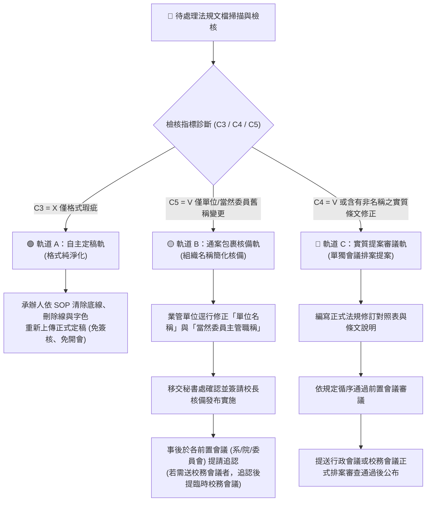

# 🏛️ 輔英科技大學 全校法規檢核六大條件 (C1~C6) 與通案包裹新制規則說明

> **行政決議依據**：依據本校行政會議「因應組織編制調整與單位名稱變更法規修訂通案包裹處置案」最新決議修訂。  
> **適用範圍**：全校 36 個單位（行政處室、四大學院、系所、研究中心）、全體列管法規文檔  
> **生效與執行學年度**：115 學年度第 1 學期（115-1）起正式實施

---

## 📜 官方行政會議決議核心條款摘要

根據校方最新行政會議指示，法規修訂審議程序精簡與分流原則如下：

1. **單位名稱同步修正**：因應組織編制調整及行政單位名稱變更，各單位業管規章、辦法、要點中，凡涉及舊單位名稱或舊機關稱謂者，均須配合同步修正。
2. **採通案包裹授權核備（精簡程序）**：
   - 凡僅涉及**「單位/組織名稱」**文字修訂，或各委員會設置要點/辦法內文之**「當然委員中組織/單位主管名稱」**文字修訂者，採**「通案包裹方式」**辦理。
   - **授權各業管單位逕行修訂文字內容後，交由秘書處確認簽請核備後實施**，無須逐案排入行政會議發言審議。
3. **前置會議事後追認機制**：
   - 若法規修訂程序規定須經前置會議（如院務會議、系務會議、教評會、研發會等）審議者，事後於相關前置會議中**「提請追認」**即可。
   - 若須提送校務會議審議之法規（如辦法、學則），先提請權責前置會議追認通過後，提送臨時校務會議完成程序。
4. **實質條文修訂分流（禁止混入通案包裹）**：
   - 若法規含有**「非因組織規程單位/組織名稱變更之條文實質修訂內容」**（如條文增刪、資格或條件變更），**不得使用通案包裹簽核**，必須另行於後續會議再次單獨提案審議。

---

## 🎯 新制「法規檢核六個條件 (C1~C6)」定義與處置方針

依據上述決議，現將全校法規體檢之 **C1 至 C6 六大條件** 重構如下：

| 指標代碼 | 檢核項目名稱 | 設問邏輯與檢核重點 | 判定符號與定義 | 新制處置與流程方針 (Rules & Protocols) |
| :---: | :--- | :--- | :---: | :--- |
| **C1** | **最新版本與位階** | 是否已更新為現行最新版本且登錄位階？ | 🟢 **V = 合格最新** 🔴 **X = 版本未符** | 登錄至《法規位階關係檔》，確立 Level 1~5 位階授權關係。 |
| **C2** | **法規名稱正確性** | 名稱是否符合法定類型且保留更名歷程？ | 🟢 **V = 合格正確** 🔴 **X = 名稱瑕疵** | 補齊更名歷史脈絡標註（如包含 `(原：舊法規名稱)`）。 |
| **C3** | **格式潔淨度** | 是否純淨無底線、刪除線、紅藍字或修訂標籤？ | 🟢 **V = 格式乾淨** 🔴 **X = 格式瑕疵** | **【自主定稿軌】免開會！** 由承辦單位自行清除底線、字色與修訂標記後重新上傳定稿。 |
| **C4** | **逾期實質修法提案** | 是否超過 2 年未更新（最後修訂 $\le 112$ 年）且含實質條文修訂？ | 🟡 **V = 逾期需提案** ⚪ **X = 時效正常** | **【實質提案軌】需單獨排案！** 若含非名稱之實質條文修正，**不得混入通案包裹**，須提送前置會議及行政會議/校務會議單獨提案。 |
| **C5** | **組織稱謂與通案包裹核備** | 是否包含舊單位稱謂（如科技部、衛生署、研發處、電算中心等）或當然委員舊職稱？ | 🔴 **V = 含舊稱需核備** ⚪ **X = 稱謂正常** | **【通案包裹核備軌】免開會排案！** 逕行修正單位/當然委員主管名稱 &rarr; **送秘書處確認簽核備實施** &rarr; 事後提前置會議追認。 |
| **C6** | **母子法位階授權鏈結** | 第一條是否具備明確上位授權母法依據？審議會議位階是否相當？ | 🟢 **V = 授權健全/母法** 🔴 **X = 缺母法/會議錯置** | **【位階整改軌】** 診斷第一條母法引用。 • 缺母法者：建議於 115 提案修訂第一條，補正母法依據。 • 會議錯置者：調整審議會議層級或修正法規名稱。 |

---

## 🚀 重新新設：全校法規修訂「三軌分流處置機制」 (Three-Track Framework)

為落實行政會議精簡程序與嚴謹審議之要求，全新確立全校法規處置 **三軌作業流程**：

---

## 📋 三軌處置機制詳細說明與對照表

| 處置軌道 | 適用情境與觸發條件 | 授權與審核關卡 | 議事與排案程序 | 事後追認與備查要求 |
| :--- | :--- | :--- | :--- | :--- |
| **軌道 A 自主定稿軌** | • `C3 = X`（純文字格式瑕疵） • 殘存底線、刪除線、紅藍字或 Word 追蹤修訂標籤 | 各業管單位承辦人 | **無需開會！ 無需提案！** | 清除標籤後直接替換校內法規庫 PDF/DOCX 檔 |
| **軌道 B 通案包裹核備軌** | • `C5 = V` 且不含實質條文變更 • 內文「單位/組織名稱」變更 • 各委員會「當然委員主管職稱」變更 | **秘書處確認簽請核備** | **免提行政會議排案發言！** 採通案包裹授權核備 | 事後於相關前置會議（院務/系務/委員會）**提請追認**；校務會議法規追認後提送臨時校務會議 |
| **軌道 C 實質提案審議軌** | • `C4 = V`（逾期未更新） • **含有非單位名稱變更之實質條文修正**（如資格、比例、程序變更） | 原法規訂定之審議權責會議（行政會議 / 校務會議） | **嚴禁混入通案包裹！** 須單獨提案排入會議議程審議 | 須先經前置會議審議通過，方得提送行政會議或校務會議審查 |

---

## 💡 各單位承辦人員實務操作指南 (Q&A)

### Q1：如果我們單位的辦法裡面，既有「科技部」改「國科會」（組織舊稱），又有修改「申請資格從2年改成3年」（實質條文），可以走通案包裹嗎？
> ❌ **不可以！** 依據決議第五條：「若法規有非因組織規程單位/組織名稱變更之文字修訂內容，請各單位另行於後續會議再次提案修訂法規之文字內容。」此類情況必須走 **【軌道 C：實質提案審議軌】**，單獨提案送會議審議。

### Q2：如果法規「完全只有修正單位名稱」（例如：將『研發處』一律修改為『研發與永續發展處』），流程怎麼走？
> ✅ 走 **【軌道 B：通案包裹核備軌】**：
> 1. 承辦人直接修改 Word 檔內文中的單位名稱。
> 2. 彙整送秘書處確認，由秘書處統一簽請核備實施發布。
> 3. 於單位下次召開前置會議（如院務會議/處務會議）時，於議程中加入「提請追認」案即可。

### Q3：格式有底線和紅字的檔案（C3=X），需要送秘書處核備嗎？
> ❌ **不需要！** 格式問題屬於文件維護品質（軌道 A），承辦人直接將底線與顏色清除後重新上傳即可，不需要任何會議提案或簽核備程序。
